# System Architecture

## Overview

Video Meet is a full-stack video conferencing application built with a microservices-inspired architecture, featuring a NestJS backend, React frontend, and integration with LiveKit/OpenVidu for real-time video communication.

## High-Level Architecture

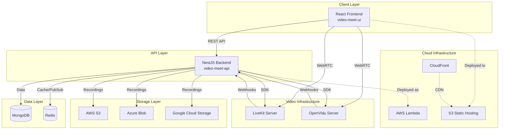

## Backend Architecture

### Modular Design

The backend follows NestJS modular architecture with clear separation of concerns:

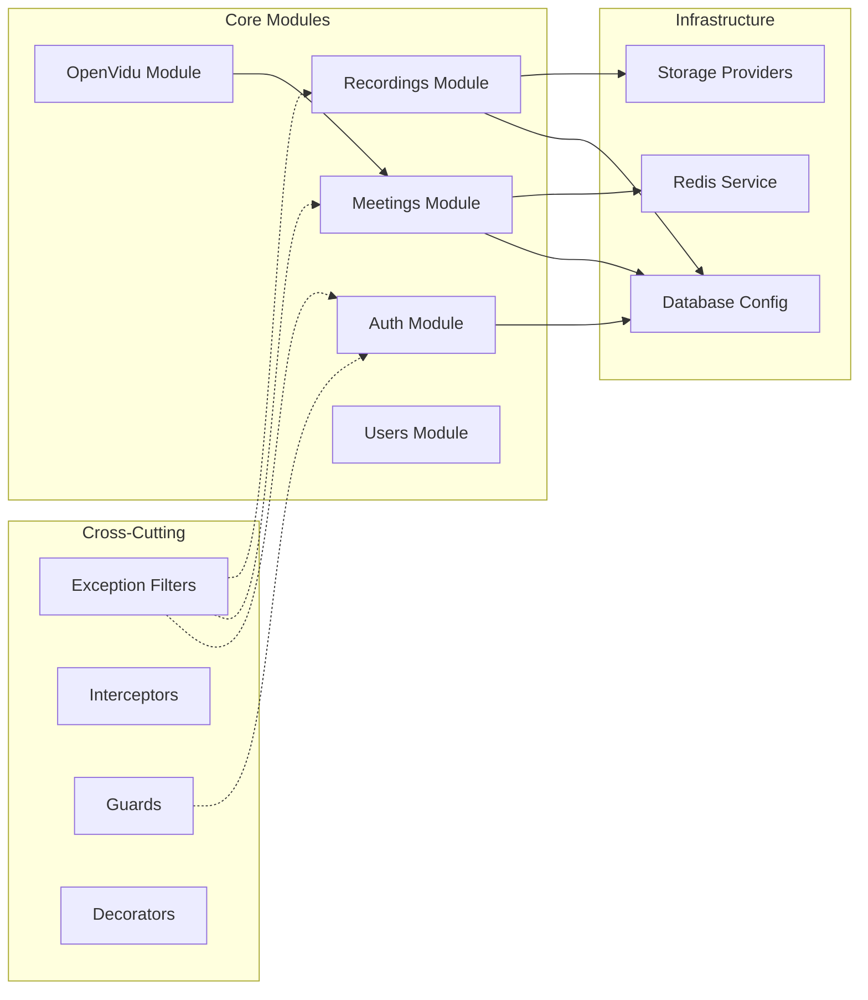

### Layered Architecture

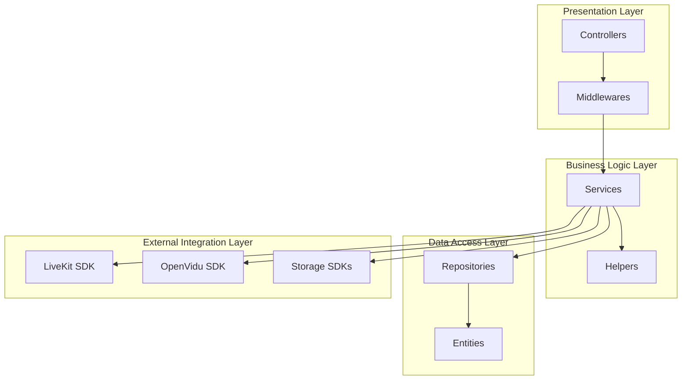

## Frontend Architecture

### Component Hierarchy

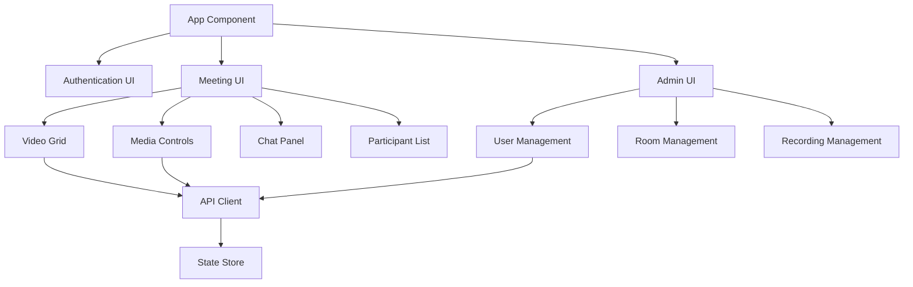

## Data Flow Architecture

### Meeting Creation Flow

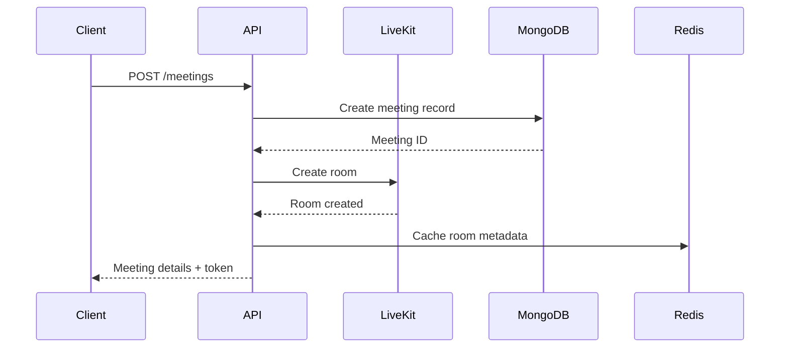

### Recording Workflow

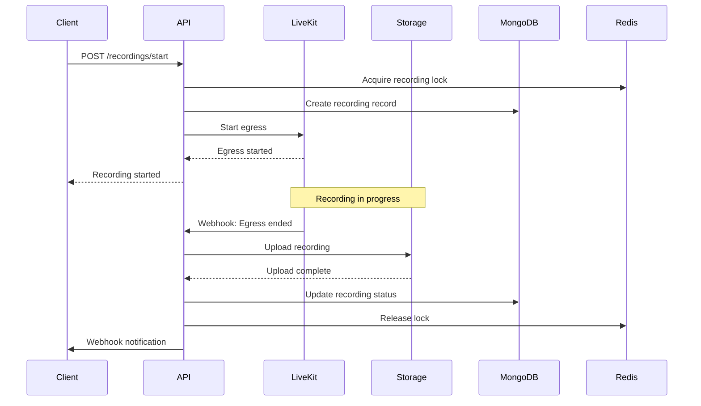

### Webhook Processing

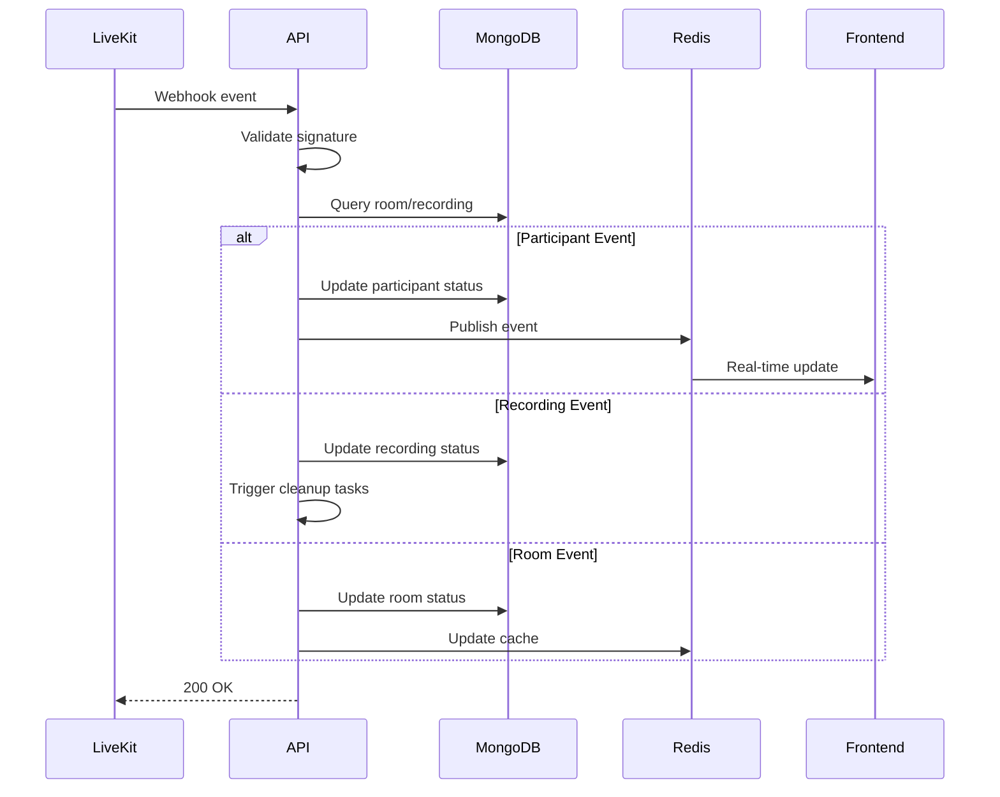

## Storage Architecture

### Multi-Cloud Storage Strategy

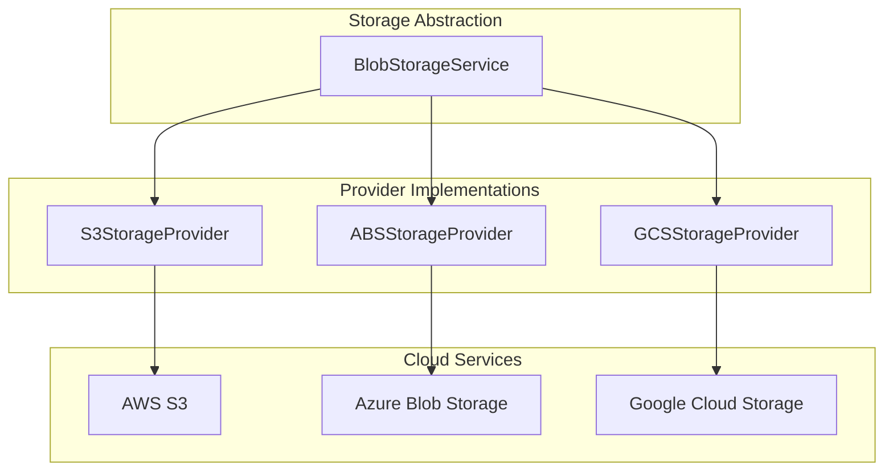

### Storage Operations

- **Recording Upload:** Streaming upload with retry logic
- **Recording Download:** Range request support for partial downloads
- **Batch Deletion:** Efficient bulk delete operations
- **Health Checks:** Provider availability monitoring

## Distributed Systems Patterns

### Distributed Locking

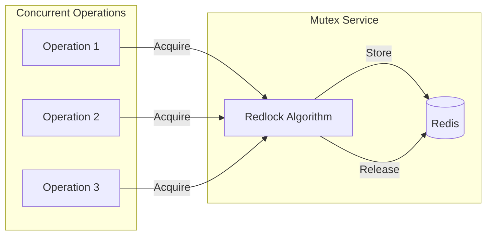

**Use Cases:**
- Recording start/stop operations
- Participant name reservation
- Room status updates

### Pub/Sub Pattern

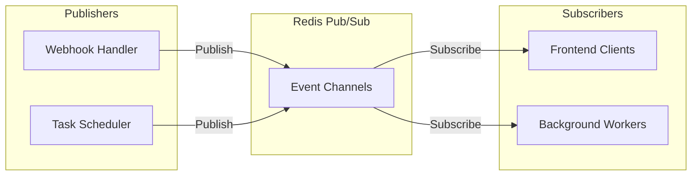

## Scheduled Tasks Architecture

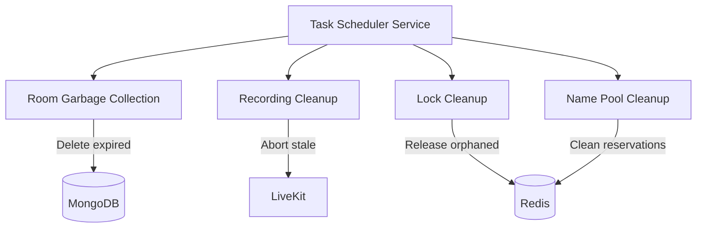

**Scheduled Tasks:**
- **Room Validation:** Check and cleanup expired rooms
- **Recording Cleanup:** Abort stale recordings, release locks
- **Participant Name Cleanup:** Release expired name reservations
- **Lock Maintenance:** Remove orphaned distributed locks

## Security Architecture

### Authentication Flow

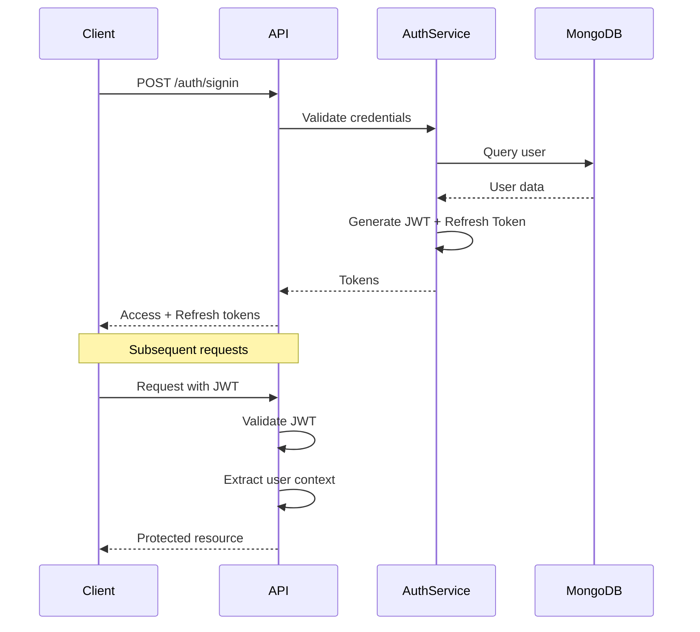

### Authorization Layers

1. **JWT Guards:** Validate access tokens
2. **Role-Based Access:** Moderator, Speaker, Viewer roles
3. **Recording Permissions:** Separate permissions for recording operations
4. **Room Access Control:** Secret-based room access

## Deployment Architecture

### AWS Infrastructure (CDK)

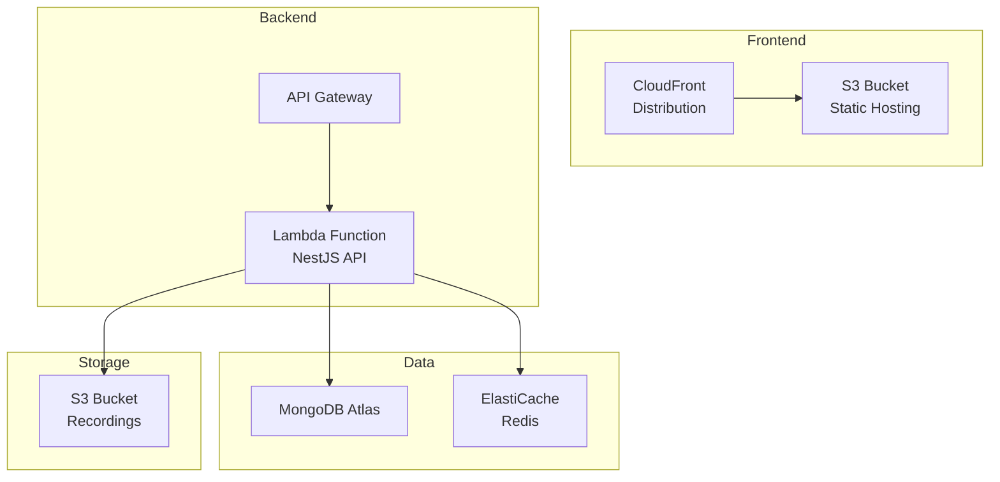

### Container Deployment (Alternative)

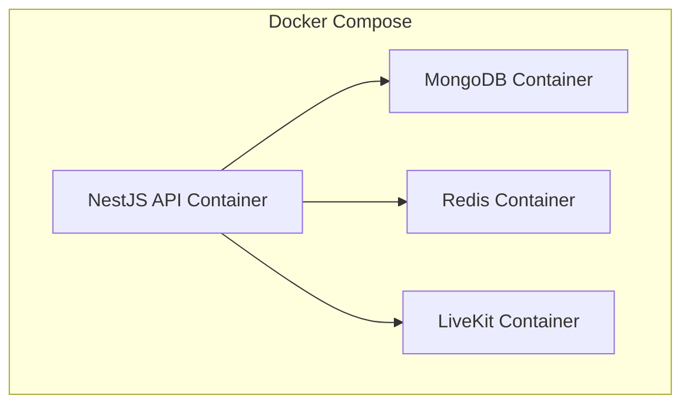

## Design Patterns

### Repository Pattern
- Abstracts data access logic
- Provides consistent interface for CRUD operations
- Supports cursor-based pagination

### Service Layer Pattern
- Encapsulates business logic
- Coordinates between repositories and external services
- Handles transaction management

### Provider Pattern
- Pluggable storage implementations
- Consistent interface across cloud providers
- Easy to add new providers

### Observer Pattern
- Webhook event handling
- Real-time updates via Redis pub/sub
- Frontend event subscriptions

### Strategy Pattern
- Different recording strategies (composite, track)
- Multiple authentication strategies
- Configurable deletion policies

## Scalability Considerations

### Horizontal Scaling
- Stateless API design
- Redis for shared state
- Load balancer ready

### Vertical Scaling
- Efficient database queries with indexes
- Connection pooling
- Caching strategies

### Performance Optimizations
- Cursor-based pagination
- Lazy loading
- Background job processing
- CDN for static assets

## Monitoring & Observability

### Health Checks
- Database connectivity
- Redis connectivity
- Storage provider availability
- LiveKit/OpenVidu connectivity

### Logging
- Structured logging with context
- Request/response logging
- Error tracking
- Webhook event logging

## Technology Decisions

### Why NestJS?
- Enterprise-grade architecture
- Built-in dependency injection
- TypeScript support
- Extensive ecosystem

### Why LiveKit/OpenVidu?
- Open-source WebRTC infrastructure
- Recording capabilities
- Scalable architecture
- Webhook support

### Why MongoDB?
- Flexible schema for evolving requirements
- Good performance for read-heavy workloads
- Native JSON support
- Easy replication

### Why Redis?
- Fast in-memory operations
- Pub/sub capabilities
- Distributed locking (Redlock)
- Session management

### Why Multi-Cloud Storage?
- Vendor flexibility
- Cost optimization
- Geographic distribution
- Redundancy options
