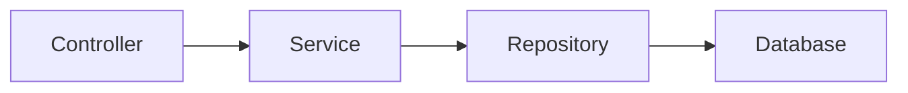
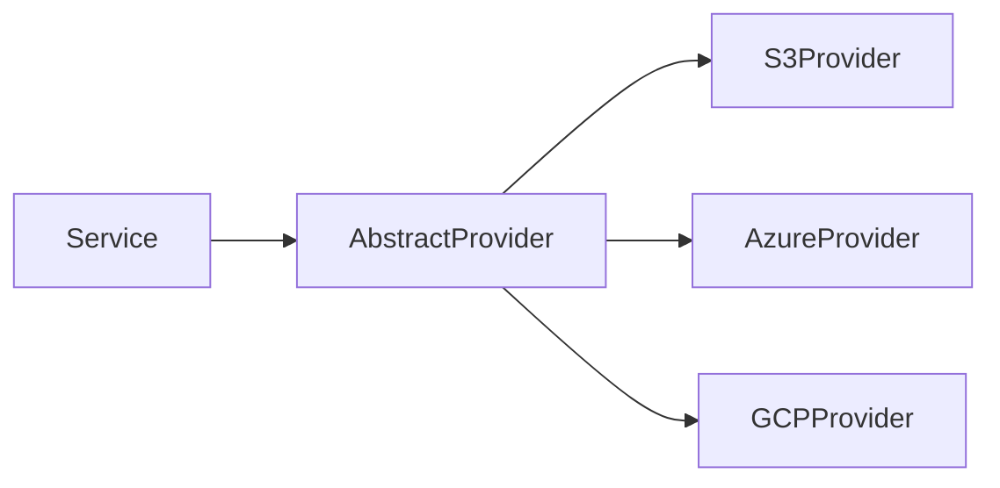

# Components Documentation

## Overview

This document describes the major components of the Video Meet application, their responsibilities, and interactions.

## Backend Components

### Core Services

#### RecordingService
**Location:** `video-meet-api/src/modules/recordings/recordings.service.ts` (and example-openvidu variants)  
**Lines of Code:** 759  
**Responsibility:** Complete recording lifecycle management

**Key Methods:**
- `startRecording()` - Initiates recording with LiveKit egress
- `stopRecording()` - Stops active recording
- `getAllRecordings()` - Lists recordings with pagination
- `getRecording()` - Retrieves single recording details
- `deleteRecording()` - Removes recording and media files
- `bulkDeleteRecordings()` - Batch deletion operations
- `getRecordingAsStream()` - Streams recording media
- `acquireRoomRecordingActiveLock()` - Distributed locking for recording operations
- `handleRecordingTimeout()` - Manages recording timeouts

**Dependencies:**
- `LiveKitService` - Video infrastructure
- `RecordingRepository` - Data persistence
- `BlobStorageService` - Media storage
- `MutexService` - Distributed locking
- `RecordingHelper` - Data transformation

**Design Patterns:**
- Service Layer Pattern
- Repository Pattern
- Distributed Locking

---

#### RoomService
**Location:** `video-meet-api/example-openvidu/backend/src/services/room.service.ts`  
**Lines of Code:** 620  
**Responsibility:** Meeting room lifecycle and configuration management

**Key Methods:**
- `createMeetRoom()` - Creates new meeting room
- `getMeetRoom()` - Retrieves room details
- `getAllMeetRooms()` - Lists all rooms with pagination
- `updateMeetRoomConfig()` - Updates room configuration
- `updateMeetRoomStatus()` - Changes room status
- `deleteMeetRoom()` - Deletes single room
- `bulkDeleteMeetRooms()` - Batch room deletion
- `meetRoomExists()` - Checks room existence
- `createLivekitRoom()` - Creates LiveKit room

**Dependencies:**
- `LiveKitService` - Room creation in video infrastructure
- `RoomRepository` - Data persistence
- `RecordingService` - Recording management
- `MutexService` - Locking for concurrent operations

---

#### LiveKitService
**Location:** `video-meet-api/example-openvidu/backend/src/services/livekit.service.ts`  
**Lines of Code:** 411  
**Responsibility:** LiveKit SDK integration and room management

**Key Methods:**
- `createRoom()` - Creates LiveKit room
- `getRoom()` - Retrieves room information
- `listRooms()` - Lists all rooms
- `deleteRoom()` - Deletes room
- `batchDeleteRooms()` - Bulk room deletion
- `listRoomParticipants()` - Gets participants in room
- `getParticipant()` - Retrieves participant details
- `updateParticipantMetadata()` - Updates participant info
- `deleteParticipant()` - Removes participant from room
- `startRoomComposite()` - Starts composite recording
- `stopEgress()` - Stops recording egress
- `getEgress()` - Retrieves egress information

**Dependencies:**
- `livekit-server-sdk` - Official LiveKit SDK
- Configuration for LiveKit URL and API credentials

---

#### RoomMemberService
**Location:** `video-meet-api/example-openvidu/backend/src/services/room-member.service.ts`  
**Lines of Code:** 388  
**Responsibility:** Participant management and token generation

**Key Methods:**
- `generateOrRefreshRoomMemberToken()` - Creates/refreshes participant tokens
- `generateTokenWithJoinMeetingPermission()` - Token with join permissions
- `generateTokenWithoutJoinMeetingPermission()` - Token without join permissions
- `getRoomMemberPermissions()` - Determines participant permissions
- `getRoomMemberRoleBySecret()` - Resolves role from secret
- `kickParticipantFromMeeting()` - Removes participant
- `updateParticipantRole()` - Changes participant role
- `existsParticipantInMeeting()` - Checks participant presence
- `getParticipantFromMeeting()` - Retrieves participant info
- `cleanupParticipantNames()` - Releases name reservations

**Dependencies:**
- `LiveKitService` - Participant operations
- `ParticipantNameService` - Unique name generation
- `RoomRepository` - Room data access

---

#### RedisService
**Location:** `video-meet-api/example-openvidu/backend/src/services/redis.service.ts`  
**Lines of Code:** 386  
**Responsibility:** Redis operations, caching, and pub/sub

**Key Methods:**
- `get()`, `set()`, `delete()` - Basic key-value operations
- `exists()` - Key existence check
- `getKeys()` - Pattern-based key retrieval
- `setIfNotExists()` - Atomic set operation
- `setExpiration()` - TTL management
- `publishEvent()` - Pub/sub publishing
- `subscribe()`, `unsubscribe()` - Pub/sub subscriptions
- `createRedlock()` - Distributed lock creation
- `addToSortedSet()`, `popMinFromSortedSet()` - Sorted set operations

**Dependencies:**
- `ioredis` - Redis client
- Configuration for Redis connection

**Design Patterns:**
- Singleton Pattern
- Pub/Sub Pattern
- Distributed Locking (Redlock)

---

#### ParticipantNameService
**Location:** `video-meet-api/example-openvidu/backend/src/services/participant-name.service.ts`  
**Lines of Code:** 353  
**Responsibility:** Unique participant name generation and reservation

**Key Methods:**
- `reserveUniqueName()` - Reserves unique name for participant
- `releaseName()` - Releases name reservation
- `isNameReserved()` - Checks if name is reserved
- `getReservedNames()` - Lists all reserved names
- `generateAlternativeName()` - Creates alternative when name taken
- `cleanupExpiredReservations()` - Removes expired reservations

**Algorithm:**
- Uses Redis for distributed name reservation
- Appends numbers to duplicate names (e.g., "John", "John 2", "John 3")
- Maintains number pool for efficient reuse
- TTL-based expiration for cleanup

---

#### RecordingScheduledTasksService
**Location:** `video-meet-api/example-openvidu/backend/src/services/recording-scheduled-tasks.service.ts`  
**Lines of Code:** 332  
**Responsibility:** Background tasks for recording maintenance

**Key Methods:**
- `registerScheduledTasks()` - Registers cron jobs
- `performActiveRecordingLocksGC()` - Cleans up recording locks
- `performStaleRecordingsGC()` - Aborts stale recordings
- `evaluateAndReleaseOrphanedLock()` - Releases orphaned locks
- `evaluateAndAbortStaleRecording()` - Aborts stuck recordings

**Scheduled Tasks:**
- Lock cleanup: Every 5 minutes
- Stale recording check: Every 10 minutes

---

#### OpenViduWebhookService
**Location:** `video-meet-api/example-openvidu/backend/src/services/openvidu-webhook.service.ts`  
**Lines of Code:** 330  
**Responsibility:** Outgoing webhook notifications

**Key Methods:**
- `sendMeetingStartedWebhook()` - Notifies meeting start
- `sendMeetingEndedWebhook()` - Notifies meeting end
- `sendRecordingStartedWebhook()` - Notifies recording start
- `sendRecordingUpdatedWebhook()` - Notifies recording updates
- `sendRecordingEndedWebhook()` - Notifies recording end
- `testWebhookUrl()` - Tests webhook endpoint
- `generateWebhookSignature()` - Creates HMAC signature

**Features:**
- Retry logic with exponential backoff
- Signature-based authentication
- Background processing

---

#### LivekitWebhookService
**Location:** `video-meet-api/example-openvidu/backend/src/services/livekit-webhook.service.ts`  
**Lines of Code:** 369  
**Responsibility:** Incoming LiveKit webhook processing

**Key Methods:**
- `getEventFromWebhook()` - Parses webhook payload
- `handleEgressStarted()` - Processes egress start events
- `handleEgressUpdated()` - Processes egress update events
- `handleEgressEnded()` - Processes egress end events
- `handleParticipantJoined()` - Processes participant join
- `handleParticipantLeft()` - Processes participant leave
- `handleRoomStarted()` - Processes room start
- `handleRoomFinished()` - Processes room end
- `processRecordingEgress()` - Handles recording egress events

**Event Types Handled:**
- Egress lifecycle (started, updated, ended)
- Participant lifecycle (joined, left)
- Room lifecycle (started, finished)

---

### Storage Components

#### BlobStorageService
**Location:** `video-meet-api/example-openvidu/backend/src/services/storage/blob-storage.service.ts`  
**Lines of Code:** 219  
**Responsibility:** Unified interface for multi-cloud storage

**Key Methods:**
- `getRecordingMedia()` - Retrieves recording with range support
- `deleteRecordingMedia()` - Deletes single recording
- `deleteRecordingMediaBatch()` - Batch deletion
- `recordingMediaExists()` - Checks recording existence
- `getRecordingFileSize()` - Gets file size
- `validateAndAdjustRange()` - Validates HTTP range requests
- `checkHealth()` - Health check for storage provider

**Supported Providers:**
- AWS S3
- Azure Blob Storage
- Google Cloud Storage

---

#### S3Service
**Location:** `video-meet-api/example-openvidu/backend/src/services/storage/providers/s3/s3.service.ts`  
**Lines of Code:** 336  
**Responsibility:** AWS S3 integration

**Key Methods:**
- `saveObject()` - Uploads object to S3
- `getObject()` - Downloads object
- `getObjectAsStream()` - Streams object
- `getObjectAsJson()` - Parses JSON object
- `deleteObjects()` - Batch deletion
- `exists()` - Checks object existence
- `listObjectsPaginated()` - Lists objects with pagination
- `getObjectHeaders()` - Retrieves object metadata

**Features:**
- Retry logic with exponential backoff
- Streaming support
- Batch operations

---

#### GCSService
**Location:** `video-meet-api/example-openvidu/backend/src/services/storage/providers/gcp/gcs.service.ts`  
**Lines of Code:** 359  
**Responsibility:** Google Cloud Storage integration

**Key Methods:**
- Similar to S3Service but for GCS
- Uses `@google-cloud/storage` SDK

---

#### ABSService
**Location:** `video-meet-api/example-openvidu/backend/src/services/storage/providers/abs/abs.service.ts`  
**Lines of Code:** 309  
**Responsibility:** Azure Blob Storage integration

**Key Methods:**
- Similar to S3Service but for Azure
- Uses `@azure/storage-blob` SDK

---

#### MongoDBService
**Location:** `video-meet-api/example-openvidu/backend/src/services/storage/mongodb.service.ts`  
**Lines of Code:** 141  
**Responsibility:** MongoDB connection management

**Key Methods:**
- `connect()` - Establishes database connection
- `disconnect()` - Closes connection
- `checkHealth()` - Health check
- `buildMongoConnectionString()` - Constructs connection URI

---

### Repository Components

#### RoomRepository
**Location:** `video-meet-api/example-openvidu/backend/src/repositories/room.repository.ts`  
**Lines of Code:** 268  
**Responsibility:** Room data persistence

**Key Methods:**
- `create()` - Creates room record
- `update()` - Updates room
- `findByRoomId()` - Finds room by ID
- `find()` - Finds rooms with filters
- `findExpiredRooms()` - Finds expired rooms
- `findActiveRooms()` - Finds active rooms
- `deleteByRoomId()` - Deletes room
- `deleteByRoomIds()` - Batch deletion
- `countTotal()` - Counts all rooms
- `countActiveRooms()` - Counts active rooms

**Features:**
- Cursor-based pagination
- URL enrichment for recordings
- Domain model transformation

---

#### RecordingRepository
**Location:** `video-meet-api/example-openvidu/backend/src/repositories/recording.repository.ts`  
**Lines of Code:** 232  
**Responsibility:** Recording data persistence

**Key Methods:**
- `create()` - Creates recording record
- `update()` - Updates recording
- `findByRecordingId()` - Finds recording by ID
- `find()` - Finds recordings with filters
- `findAllByRoomId()` - Finds recordings for room
- `findActiveRecordings()` - Finds in-progress recordings
- `deleteByRecordingId()` - Deletes recording
- `deleteByRecordingIds()` - Batch deletion
- `countTotal()` - Counts all recordings
- `countCompleteRecordings()` - Counts completed recordings

---

#### BaseRepository
**Location:** `video-meet-api/example-openvidu/backend/src/repositories/base.repository.ts`  
**Lines of Code:** 374  
**Responsibility:** Common repository operations

**Key Methods:**
- `findOne()` - Finds single document
- `findAll()` - Finds all documents
- `findMany()` - Finds with filters
- `createDocument()` - Creates document
- `updateOne()` - Updates document
- `deleteOne()` - Deletes document
- `deleteMany()` - Batch deletion
- `count()` - Counts documents
- `encodeCursor()`, `decodeCursor()` - Cursor pagination

---

### Helper Components

#### RecordingHelper
**Location:** `video-meet-api/example-openvidu/backend/src/helpers/recording.helper.ts`  
**Lines of Code:** 264  
**Responsibility:** Recording data transformation and extraction

**Key Methods:**
- `toRecordingInfo()` - Transforms to API response format
- `extractInfoFromRecordingId()` - Parses recording ID
- `extractFilename()` - Extracts filename from path
- `extractDuration()` - Calculates duration
- `extractStartDate()`, `extractEndDate()` - Extracts timestamps
- `extractSize()` - Extracts file size
- `canBeDeleted()` - Checks if recording can be deleted
- `isRecordingEgress()` - Validates egress type

---

#### MutexService
**Location:** `video-meet-api/example-openvidu/backend/src/services/mutex.service.ts`  
**Lines of Code:** 156  
**Responsibility:** Distributed locking

**Key Methods:**
- `acquire()` - Acquires lock
- `release()` - Releases lock
- `getLocksByPrefix()` - Lists locks by prefix
- `lockExists()` - Checks lock existence
- `getLockCreatedAt()` - Gets lock creation time
- `getLockData()` - Retrieves lock metadata

**Implementation:**
- Uses Redlock algorithm
- Configurable TTL
- Automatic extension support

---

### Utility Components

#### TaskSchedulerService
**Location:** `video-meet-api/example-openvidu/backend/src/services/task-scheduler.service.ts`  
**Lines of Code:** 163  
**Responsibility:** Cron job management

**Key Methods:**
- `registerTask()` - Registers scheduled task
- `scheduleTask()` - Schedules task execution
- `cancelTask()` - Cancels scheduled task
- `msStringToCronExpression()` - Converts ms to cron

**Features:**
- Cron-based scheduling
- Task registration and cancellation
- Flexible interval configuration

---

#### MigrationService
**Location:** `video-meet-api/example-openvidu/backend/src/services/migration.service.ts`  
**Lines of Code:** 270  
**Responsibility:** Database schema migrations

**Key Methods:**
- `runMigrations()` - Executes pending migrations
- `runSchemaMigrations()` - Runs schema migrations
- `getCurrentSchemaVersion()` - Gets current version
- `findNeededMigrations()` - Identifies pending migrations

---

#### GlobalConfigService
**Location:** `video-meet-api/example-openvidu/backend/src/services/global-config.service.ts`  
**Lines of Code:** 231  
**Responsibility:** Application configuration management

**Key Methods:**
- `initializeGlobalConfig()` - Initializes default config
- `getGlobalConfig()` - Retrieves configuration
- `saveGlobalConfig()` - Saves configuration
- `getWebhookConfig()`, `updateWebhookConfig()` - Webhook settings
- `getSecurityConfig()`, `updateSecurityConfig()` - Security settings
- `getRoomsAppearanceConfig()`, `updateRoomsAppearanceConfig()` - UI settings

---

#### FrontendEventService
**Location:** `video-meet-api/example-openvidu/backend/src/services/frontend-event.service.ts`  
**Lines of Code:** 151  
**Responsibility:** Real-time frontend notifications

**Key Methods:**
- `sendRecordingSignalToOpenViduComponents()` - Recording updates
- `sendRoomStatusSignalToOpenViduComponents()` - Room status updates
- `sendRoomConfigUpdatedSignal()` - Config change notifications
- `sendParticipantRoleUpdatedSignal()` - Role change notifications
- `sendSignal()` - Generic signal sending

---

## Frontend Components

### UserManagement Component
**Location:** `video-meet-ui/src/components/UserManagement.tsx`  
**Lines of Code:** 313  
**Responsibility:** User administration interface

**Features:**
- User listing
- User creation/editing
- Role management
- User deletion

---

### MediaControls Component
**Location:** `video-meet-ui/src/components/MediaControls.tsx`  
**Lines of Code:** 147  
**Responsibility:** Audio/video control interface

**Features:**
- Microphone toggle
- Camera toggle
- Screen sharing
- Device selection

---

### App Component
**Location:** `video-meet-ui/src/App.tsx`  
**Lines of Code:** 1,326  
**Responsibility:** Main application component

**Features:**
- Routing
- Authentication state
- Layout management

---

## Infrastructure Components

### InfraStack (CDK)
**Location:** `video-meet-api/infra/lib/infra-stack.ts`  
**Lines of Code:** 647 (TypeScript), 454 (JavaScript)  
**Responsibility:** AWS infrastructure definition

**Resources Created:**
- Lambda function for API
- S3 buckets for static hosting and recordings
- CloudFront distribution
- API Gateway
- IAM roles and policies
- Custom resources for deployment

---

## Component Interaction Patterns

### Service-Repository Pattern

### Event-Driven Pattern

### Provider Pattern

## Component Dependencies

### High-Level Dependencies
- Controllers depend on Services
- Services depend on Repositories and External SDKs
- Repositories depend on Database Entities
- All components can use Helpers and Utilities

### Cross-Cutting Concerns
- Exception Filters wrap all controllers
- Interceptors handle logging and transformation
- Guards handle authentication and authorization
- Decorators provide metadata and validation
