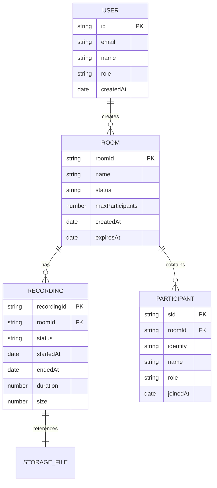

# Data Models

## Overview

This document describes the data structures, database schemas, and domain models used in the Video Meet application.

## Database Collections

### Rooms Collection

**Purpose:** Stores meeting room information

**Schema:**
```typescript
{
  _id: ObjectId;
  roomId: string;              // Unique room identifier
  name: string;                // Display name
  status: 'active' | 'ended' | 'expired';
  maxParticipants: number;     // Maximum allowed participants
  currentParticipants: number; // Current participant count
  createdAt: Date;
  updatedAt: Date;
  expiresAt?: Date;            // Auto-expiration timestamp
  recordingEnabled: boolean;
  metadata: {
    createdBy?: string;
    description?: string;
    tags?: string[];
    customData?: Record<string, any>;
  };
  config: {
    allowRecording: boolean;
    requireAuth: boolean;
    moderatorSecret?: string;
    speakerSecret?: string;
    viewerSecret?: string;
  };
  livekitRoomId?: string;      // LiveKit room SID
  baseUrls?: {
    recordingUrl?: string;
  };
}
```

**Indexes:**
- `roomId` (unique)
- `status`
- `expiresAt`
- `createdAt`

---

### Recordings Collection

**Purpose:** Stores recording metadata and status

**Schema:**
```typescript
{
  _id: ObjectId;
  recordingId: string;         // Unique recording identifier
  roomId: string;              // Associated room
  egressId: string;            // LiveKit egress ID
  status: 'starting' | 'active' | 'stopping' | 'complete' | 'failed' | 'aborted';
  startedAt: Date;
  endedAt?: Date;
  updatedAt: Date;
  duration?: number;           // Duration in seconds
  size?: number;               // File size in bytes
  layout: 'grid' | 'speaker' | 'custom';
  encoding: 'h264' | 'vp8' | 'vp9';
  filepath: string;            // Storage path
  filename: string;
  error?: string;              // Error message if failed
  metadata: {
    width?: number;
    height?: number;
    fps?: number;
    bitrate?: number;
  };
  accessSecrets: {
    moderatorSecret?: string;
    speakerSecret?: string;
    viewerSecret?: string;
  };
  downloadUrl?: string;
}
```

**Indexes:**
- `recordingId` (unique)
- `roomId`
- `status`
- `startedAt`
- `egressId`

---

### Users Collection

**Purpose:** Stores user account information

**Schema:**
```typescript
{
  _id: ObjectId;
  email: string;               // Unique email
  password: string;            // Hashed password
  name: string;
  role: 'admin' | 'user';
  createdAt: Date;
  updatedAt: Date;
  lastLoginAt?: Date;
  isActive: boolean;
  metadata: {
    avatar?: string;
    preferences?: Record<string, any>;
  };
}
```

**Indexes:**
- `email` (unique)
- `role`
- `isActive`

---

### Migrations Collection

**Purpose:** Tracks database schema versions

**Schema:**
```typescript
{
  _id: ObjectId;
  name: string;                // Migration name
  version: number;             // Schema version
  status: 'pending' | 'running' | 'completed' | 'failed';
  executedAt?: Date;
  completedAt?: Date;
  error?: string;
}
```

**Indexes:**
- `name` (unique)
- `version`
- `status`

---

### GlobalConfig Collection

**Purpose:** Stores application-wide configuration

**Schema:**
```typescript
{
  _id: ObjectId;
  version: number;
  webhook: {
    enabled: boolean;
    url?: string;
    secret?: string;
    events: string[];          // Event types to send
  };
  security: {
    requireAuth: boolean;
    allowAnonymous: boolean;
    maxSessionDuration: number;
  };
  rooms: {
    defaultMaxParticipants: number;
    defaultExpiration: number; // In seconds
    appearance: {
      theme?: string;
      logo?: string;
      colors?: Record<string, string>;
    };
  };
  recordings: {
    enabled: boolean;
    defaultLayout: string;
    defaultEncoding: string;
    maxDuration: number;       // In seconds
    storageProvider: 's3' | 'azure' | 'gcs';
  };
  updatedAt: Date;
}
```

---

## Redis Data Structures

### Distributed Locks

**Key Pattern:** `lock:{resource-type}:{resource-id}`

**Value:**
```typescript
{
  lockId: string;              // Unique lock identifier
  acquiredAt: number;          // Timestamp
  ttl: number;                 // Time to live in ms
  owner: string;               // Process/instance ID
  metadata?: Record<string, any>;
}
```

**Example Keys:**
- `lock:recording:room-123`
- `lock:participant-name:john-doe`

---

### Participant Name Reservations

**Key Pattern:** `participant-name:{room-id}:{name}`

**Value:**
```typescript
{
  participantId: string;
  reservedAt: number;
  expiresAt: number;
}
```

**Sorted Set Pattern:** `participant-name-pool:{room-id}:{base-name}`

**Members:** Available numbers for name variants (e.g., "John 2", "John 3")

---

### Room Cache

**Key Pattern:** `room:{room-id}`

**Value:** JSON-serialized room object

**TTL:** 1 hour

---

### Session Data

**Key Pattern:** `session:{session-id}`

**Value:**
```typescript
{
  userId: string;
  email: string;
  role: string;
  createdAt: number;
  expiresAt: number;
}
```

**TTL:** Configurable (default: 24 hours)

---

### Pub/Sub Channels

**Channel Patterns:**
- `room:{room-id}:events` - Room-specific events
- `recording:{recording-id}:events` - Recording events
- `global:events` - System-wide events

**Message Format:**
```typescript
{
  event: string;
  timestamp: number;
  data: Record<string, any>;
}
```

---

## Domain Models

### Meeting/Room Model

```typescript
class Room {
  id: string;
  roomId: string;
  name: string;
  status: RoomStatus;
  maxParticipants: number;
  currentParticipants: number;
  createdAt: Date;
  expiresAt?: Date;
  recordingEnabled: boolean;
  config: RoomConfig;
  metadata: RoomMetadata;
  
  isExpired(): boolean;
  isActive(): boolean;
  canJoin(): boolean;
  canRecord(): boolean;
}

enum RoomStatus {
  ACTIVE = 'active',
  ENDED = 'ended',
  EXPIRED = 'expired'
}

interface RoomConfig {
  allowRecording: boolean;
  requireAuth: boolean;
  moderatorSecret?: string;
  speakerSecret?: string;
  viewerSecret?: string;
}

interface RoomMetadata {
  createdBy?: string;
  description?: string;
  tags?: string[];
  customData?: Record<string, any>;
}
```

---

### Recording Model

```typescript
class Recording {
  id: string;
  recordingId: string;
  roomId: string;
  egressId: string;
  status: RecordingStatus;
  startedAt: Date;
  endedAt?: Date;
  duration?: number;
  size?: number;
  layout: RecordingLayout;
  encoding: RecordingEncoding;
  filepath: string;
  filename: string;
  downloadUrl?: string;
  error?: string;
  
  isComplete(): boolean;
  isActive(): boolean;
  canBeDeleted(): boolean;
  getDurationFormatted(): string;
  getSizeFormatted(): string;
}

enum RecordingStatus {
  STARTING = 'starting',
  ACTIVE = 'active',
  STOPPING = 'stopping',
  COMPLETE = 'complete',
  FAILED = 'failed',
  ABORTED = 'aborted'
}

enum RecordingLayout {
  GRID = 'grid',
  SPEAKER = 'speaker',
  CUSTOM = 'custom'
}

enum RecordingEncoding {
  H264 = 'h264',
  VP8 = 'vp8',
  VP9 = 'vp9'
}
```

---

### Participant Model

```typescript
class Participant {
  sid: string;
  identity: string;
  name: string;
  role: ParticipantRole;
  metadata: ParticipantMetadata;
  joinedAt: Date;
  isConnected: boolean;
  
  hasPermission(permission: Permission): boolean;
  canPublish(): boolean;
  canSubscribe(): boolean;
  canRecord(): boolean;
}

enum ParticipantRole {
  MODERATOR = 'moderator',
  SPEAKER = 'speaker',
  VIEWER = 'viewer'
}

interface ParticipantMetadata {
  avatar?: string;
  customData?: Record<string, any>;
}

interface Permission {
  canPublish: boolean;
  canSubscribe: boolean;
  canPublishData: boolean;
  canUpdateMetadata: boolean;
  hidden: boolean;
  recorder: boolean;
}
```

---

### User Model

```typescript
class User {
  id: string;
  email: string;
  name: string;
  role: UserRole;
  createdAt: Date;
  lastLoginAt?: Date;
  isActive: boolean;
  
  isAdmin(): boolean;
  canCreateRooms(): boolean;
  canManageRecordings(): boolean;
}

enum UserRole {
  ADMIN = 'admin',
  USER = 'user'
}
```

---

## Data Transfer Objects (DTOs)

### CreateMeetingDto

```typescript
class CreateMeetingDto {
  @IsString()
  @IsNotEmpty()
  name: string;
  
  @IsNumber()
  @IsOptional()
  @Min(1)
  @Max(100)
  maxParticipants?: number;
  
  @IsBoolean()
  @IsOptional()
  recordingEnabled?: boolean;
  
  @IsDate()
  @IsOptional()
  expiresAt?: Date;
  
  @IsObject()
  @IsOptional()
  metadata?: Record<string, any>;
}
```

---

### StartRecordingDto

```typescript
class StartRecordingDto {
  @IsString()
  @IsNotEmpty()
  roomId: string;
  
  @IsEnum(RecordingLayout)
  @IsOptional()
  layout?: RecordingLayout;
  
  @IsEnum(RecordingEncoding)
  @IsOptional()
  encoding?: RecordingEncoding;
  
  @IsObject()
  @IsOptional()
  fileOutput?: {
    filepath: string;
    disableManifest?: boolean;
  };
}
```

---

### GenerateTokenDto

```typescript
class GenerateTokenDto {
  @IsString()
  @IsNotEmpty()
  participantName: string;
  
  @IsEnum(ParticipantRole)
  role: ParticipantRole;
  
  @IsString()
  @IsOptional()
  secret?: string;
  
  @IsObject()
  @IsOptional()
  metadata?: Record<string, any>;
}
```

---

## Response Models

### PaginatedResponse

```typescript
interface PaginatedResponse<T> {
  data: T[];
  nextCursor?: string;
  hasMore: boolean;
  total?: number;
}
```

---

### ApiResponse

```typescript
interface ApiResponse<T> {
  success: boolean;
  data?: T;
  message?: string;
  error?: string;
}
```

---

## Validation Rules

### Room Validation
- Name: 1-100 characters
- Max participants: 1-100
- Expiration: Must be future date
- Status transitions: active → ended, active → expired

### Recording Validation
- Room must exist and be active
- Only one active recording per room
- Layout must be valid enum value
- Encoding must be supported

### Participant Validation
- Name: 1-50 characters
- Role must be valid enum value
- Identity must be unique within room

---

## Data Relationships



---

## Data Lifecycle

### Room Lifecycle
1. **Created** - Room is created with `active` status
2. **Active** - Participants can join, recordings can start
3. **Ended** - Manually ended or all participants left
4. **Expired** - Auto-expired based on `expiresAt` timestamp
5. **Deleted** - Removed from database (with associated recordings)

### Recording Lifecycle
1. **Starting** - Recording initiation requested
2. **Active** - Recording in progress
3. **Stopping** - Stop requested
4. **Complete** - Recording finished successfully
5. **Failed** - Recording encountered error
6. **Aborted** - Recording manually aborted
7. **Deleted** - Recording and media files removed

### Participant Lifecycle
1. **Joining** - Token generated
2. **Connected** - Participant joined room
3. **Active** - Participant publishing/subscribing
4. **Disconnected** - Participant left room
5. **Removed** - Participant kicked from room

---

## Data Retention

### Automatic Cleanup
- **Expired Rooms:** Deleted after 24 hours of expiration
- **Ended Rooms:** Retained for 7 days
- **Failed Recordings:** Retained for 30 days
- **Complete Recordings:** Retained indefinitely (manual deletion)
- **Participant Names:** Released after 1 hour of inactivity
- **Distributed Locks:** Auto-expire based on TTL

### Manual Cleanup
- Recordings can be deleted via API
- Rooms can be deleted (cascades to recordings)
- Users can be deactivated (soft delete)

---

## Data Migration Strategy

### Schema Versioning
- Migrations tracked in `migrations` collection
- Sequential version numbers
- Rollback support for failed migrations

### Migration Types
1. **Schema Migrations** - Database structure changes
2. **Data Migrations** - Data transformation
3. **Index Migrations** - Index creation/modification

### Migration Process
1. Check current schema version
2. Identify pending migrations
3. Execute migrations in order
4. Update version tracking
5. Rollback on failure
