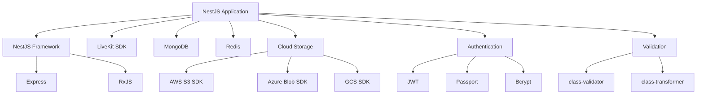
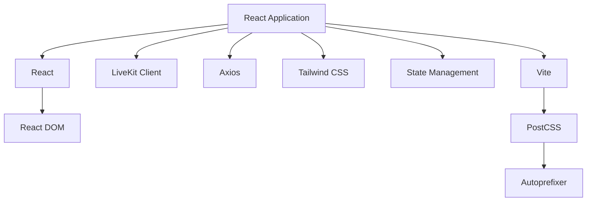

# Dependencies

## Overview

This document catalogs all external dependencies, their purposes, and usage patterns in the Video Meet application.

## Backend Dependencies (video-meet-api)

### Core Framework

#### @nestjs/core (^10.0.0)
**Purpose:** Core NestJS framework  
**Usage:** Application foundation, dependency injection, module system  
**Critical:** Yes

#### @nestjs/common (^10.0.0)
**Purpose:** Common NestJS utilities  
**Usage:** Decorators, pipes, guards, interceptors, exceptions  
**Critical:** Yes

#### @nestjs/platform-express (^10.0.0)
**Purpose:** Express platform adapter  
**Usage:** HTTP server implementation  
**Critical:** Yes

---

### Video Infrastructure

#### livekit-server-sdk (^2.0.0)
**Purpose:** LiveKit server-side SDK  
**Usage:**
- Room creation and management
- Participant token generation
- Recording (egress) control
- Webhook signature verification

**Key Classes:**
- `RoomServiceClient` - Room operations
- `AccessToken` - Token generation
- `EgressClient` - Recording management
- `WebhookReceiver` - Webhook validation

**Critical:** Yes

---

### Database

#### mongodb (^6.0.0)
**Purpose:** MongoDB driver  
**Usage:** Database connectivity and operations  
**Critical:** Yes

#### mongoose (^8.0.0)
**Purpose:** MongoDB ODM  
**Usage:**
- Schema definition
- Model creation
- Query building
- Validation

**Critical:** Yes

---

### Caching & Messaging

#### ioredis (^5.3.0)
**Purpose:** Redis client  
**Usage:**
- Key-value caching
- Pub/sub messaging
- Distributed locking
- Session storage

**Features Used:**
- Basic operations (get, set, del)
- Pub/sub channels
- Sorted sets
- TTL management

**Critical:** Yes

#### redlock (^5.0.0)
**Purpose:** Distributed locking algorithm  
**Usage:**
- Recording operation locks
- Participant name reservation
- Critical section protection

**Critical:** Yes

---

### Cloud Storage

#### @aws-sdk/client-s3 (^3.0.0)
**Purpose:** AWS S3 client  
**Usage:**
- Recording upload/download
- Streaming support
- Batch operations

**Operations:**
- `PutObjectCommand` - Upload
- `GetObjectCommand` - Download
- `DeleteObjectCommand` - Delete
- `ListObjectsV2Command` - List
- `HeadObjectCommand` - Metadata

**Critical:** For AWS deployments

#### @azure/storage-blob (^12.0.0)
**Purpose:** Azure Blob Storage client  
**Usage:**
- Recording storage on Azure
- Stream operations
- Batch deletion

**Key Classes:**
- `BlobServiceClient` - Service operations
- `ContainerClient` - Container operations
- `BlockBlobClient` - Blob operations

**Critical:** For Azure deployments

#### @google-cloud/storage (^7.0.0)
**Purpose:** Google Cloud Storage client  
**Usage:**
- Recording storage on GCP
- File operations
- Streaming support

**Critical:** For GCP deployments

---

### Authentication & Security

#### passport (^0.7.0)
**Purpose:** Authentication middleware  
**Usage:** Authentication strategy framework  
**Critical:** Yes

#### passport-jwt (^4.0.0)
**Purpose:** JWT authentication strategy  
**Usage:** JWT token validation  
**Critical:** Yes

#### @nestjs/jwt (^10.0.0)
**Purpose:** NestJS JWT module  
**Usage:**
- Token generation
- Token signing
- Token verification

**Critical:** Yes

#### bcrypt (^5.1.0)
**Purpose:** Password hashing  
**Usage:**
- Hash user passwords
- Verify password hashes

**Critical:** Yes

---

### Validation & Transformation

#### class-validator (^0.14.0)
**Purpose:** Decorator-based validation  
**Usage:**
- DTO validation
- Request body validation
- Query parameter validation

**Common Decorators:**
- `@IsString()`, `@IsNumber()`, `@IsBoolean()`
- `@IsEmail()`, `@IsUrl()`
- `@Min()`, `@Max()`, `@Length()`
- `@IsOptional()`, `@IsNotEmpty()`

**Critical:** Yes

#### class-transformer (^0.5.0)
**Purpose:** Object transformation  
**Usage:**
- Plain object to class instance
- Class instance to plain object
- Type conversion

**Critical:** Yes

---

### Reactive Programming

#### rxjs (^7.8.0)
**Purpose:** Reactive extensions  
**Usage:**
- Observable streams
- Event handling
- Async operations

**Operators Used:**
- `map`, `filter`, `mergeMap`
- `catchError`, `retry`
- `debounceTime`, `distinctUntilChanged`

**Critical:** Yes (NestJS dependency)

---

### Scheduling

#### node-cron (^3.0.0)
**Purpose:** Cron job scheduling  
**Usage:**
- Room cleanup tasks
- Recording garbage collection
- Lock maintenance
- Name reservation cleanup

**Critical:** Yes

---

### Configuration

#### @nestjs/config (^3.0.0)
**Purpose:** Configuration management  
**Usage:**
- Environment variable loading
- Configuration validation
- Type-safe config access

**Critical:** Yes

#### dotenv (^16.0.0)
**Purpose:** Environment variable loader  
**Usage:** Load .env files  
**Critical:** Yes

---

### HTTP Client

#### axios (^1.6.0)
**Purpose:** HTTP client  
**Usage:**
- Webhook sending
- External API calls
- Retry logic

**Critical:** Yes

---

### Utilities

#### uuid (^9.0.0)
**Purpose:** UUID generation  
**Usage:**
- Unique identifiers
- Recording IDs
- Session IDs

**Critical:** Yes

#### date-fns (^3.0.0)
**Purpose:** Date manipulation  
**Usage:**
- Date formatting
- Duration calculations
- Timezone handling

**Critical:** No (convenience)

---

### Development Dependencies

#### typescript (^5.0.0)
**Purpose:** TypeScript compiler  
**Usage:** Type checking and compilation  
**Critical:** Yes (development)

#### @types/node (^20.0.0)
**Purpose:** Node.js type definitions  
**Usage:** TypeScript support for Node.js APIs  
**Critical:** Yes (development)

#### eslint (^8.0.0)
**Purpose:** Code linting  
**Usage:** Code quality enforcement  
**Critical:** No (development)

#### prettier (^3.0.0)
**Purpose:** Code formatting  
**Usage:** Consistent code style  
**Critical:** No (development)

#### jest (^29.0.0)
**Purpose:** Testing framework  
**Usage:** Unit and integration tests  
**Critical:** No (development)

---

## Frontend Dependencies (video-meet-ui)

### Core Framework

#### react (^18.2.0)
**Purpose:** UI library  
**Usage:** Component-based UI development  
**Critical:** Yes

#### react-dom (^18.2.0)
**Purpose:** React DOM renderer  
**Usage:** Render React components to DOM  
**Critical:** Yes

---

### Video Client

#### livekit-client (^2.0.0)
**Purpose:** LiveKit client SDK  
**Usage:**
- Connect to LiveKit rooms
- Publish/subscribe tracks
- Handle participant events
- Data messaging

**Key Classes:**
- `Room` - Room connection
- `LocalParticipant` - Local user
- `RemoteParticipant` - Remote users
- `Track` - Audio/video tracks

**Critical:** Yes

---

### Build Tools

#### vite (^5.0.0)
**Purpose:** Build tool and dev server  
**Usage:**
- Fast development server
- Production builds
- Hot module replacement

**Critical:** Yes

#### @vitejs/plugin-react (^4.0.0)
**Purpose:** React plugin for Vite  
**Usage:** React Fast Refresh support  
**Critical:** Yes

---

### Styling

#### tailwindcss (^3.4.0)
**Purpose:** Utility-first CSS framework  
**Usage:**
- Component styling
- Responsive design
- Theme customization

**Critical:** Yes

#### postcss (^8.4.0)
**Purpose:** CSS transformation tool  
**Usage:** Process Tailwind CSS  
**Critical:** Yes

#### autoprefixer (^10.4.0)
**Purpose:** CSS vendor prefixing  
**Usage:** Browser compatibility  
**Critical:** Yes

---

### HTTP Client

#### axios (^1.6.0)
**Purpose:** HTTP client  
**Usage:**
- API requests
- Interceptors for auth
- Error handling

**Critical:** Yes

---

### State Management

#### zustand (implied)
**Purpose:** State management  
**Usage:**
- Global state
- User session
- Meeting state

**Critical:** Likely yes

---

### Development Dependencies

#### typescript (^5.0.0)
**Purpose:** TypeScript compiler  
**Usage:** Type checking  
**Critical:** Yes (development)

#### @types/react (^18.2.0)
**Purpose:** React type definitions  
**Usage:** TypeScript support for React  
**Critical:** Yes (development)

#### eslint (^8.0.0)
**Purpose:** Code linting  
**Usage:** Code quality  
**Critical:** No (development)

---

## Infrastructure Dependencies (AWS CDK)

### CDK Framework

#### aws-cdk-lib (^2.0.0)
**Purpose:** AWS CDK library  
**Usage:**
- Infrastructure as code
- CloudFormation synthesis
- Resource creation

**Constructs Used:**
- `Stack` - CloudFormation stack
- `Function` - Lambda function
- `Bucket` - S3 bucket
- `Distribution` - CloudFront
- `RestApi` - API Gateway

**Critical:** Yes

#### constructs (^10.0.0)
**Purpose:** CDK constructs library  
**Usage:** Base construct classes  
**Critical:** Yes

---

## Dependency Graph

### Backend Core Dependencies

### Frontend Core Dependencies

---

## Version Compatibility

### Node.js Version
- **Required:** Node.js 18+ (specified in .nvmrc as version 8, likely typo)
- **Recommended:** Node.js 20 LTS

### Package Manager
- **npm:** 9.0.0+
- **Alternative:** yarn 1.22.0+ or pnpm 8.0.0+

---

## Security Considerations

### Known Vulnerabilities
- Regular `npm audit` checks recommended
- Keep dependencies updated
- Monitor security advisories

### Critical Security Dependencies
- `bcrypt` - Password hashing
- `passport-jwt` - Authentication
- `@nestjs/jwt` - Token management
- `livekit-server-sdk` - Webhook verification

---

## Performance Impact

### High Performance Impact
- `mongodb` - Database queries
- `ioredis` - Caching operations
- `livekit-server-sdk` - Video operations
- Cloud storage SDKs - File operations

### Optimization Strategies
- Connection pooling (MongoDB, Redis)
- Caching frequently accessed data
- Streaming large files
- Batch operations where possible

---

## Dependency Update Strategy

### Regular Updates (Monthly)
- Security patches
- Bug fixes
- Minor version updates

### Major Updates (Quarterly)
- Major version updates
- Breaking changes review
- Compatibility testing

### Critical Updates (Immediate)
- Security vulnerabilities
- Critical bug fixes

---

## Alternative Dependencies

### Potential Replacements

**MongoDB → PostgreSQL**
- Pros: ACID compliance, better for relational data
- Cons: Less flexible schema, more complex setup

**Redis → Memcached**
- Pros: Simpler, faster for basic caching
- Cons: No pub/sub, no persistence, no data structures

**LiveKit → Jitsi**
- Pros: More mature, larger community
- Cons: Different API, migration effort

**NestJS → Express**
- Pros: Simpler, more lightweight
- Cons: Less structure, manual DI, no built-in features

---

## Dependency Licenses

### Permissive Licenses (Safe for commercial use)
- MIT: Most dependencies
- Apache 2.0: Some AWS SDKs
- BSD: Some utilities

### Copyleft Licenses (Review required)
- None identified in current dependencies

---

## Dependency Size Analysis

### Largest Dependencies
1. `@aws-sdk/*` - ~50MB (modular)
2. `@google-cloud/storage` - ~30MB
3. `@azure/storage-blob` - ~25MB
4. `mongodb` - ~20MB
5. `livekit-server-sdk` - ~15MB

### Bundle Size Optimization
- Use tree-shaking
- Import only needed modules
- Consider lighter alternatives for utilities

---

## Deprecated Dependencies

### Currently None Identified

**Monitoring Strategy:**
- Check npm deprecation warnings
- Review dependency health on npm
- Monitor GitHub repository activity

---

## Custom Dependencies

### Internal Packages
- None currently
- Consider extracting common utilities to shared packages

---

This comprehensive dependency documentation provides a complete overview of all external libraries and their roles in the Video Meet application.
