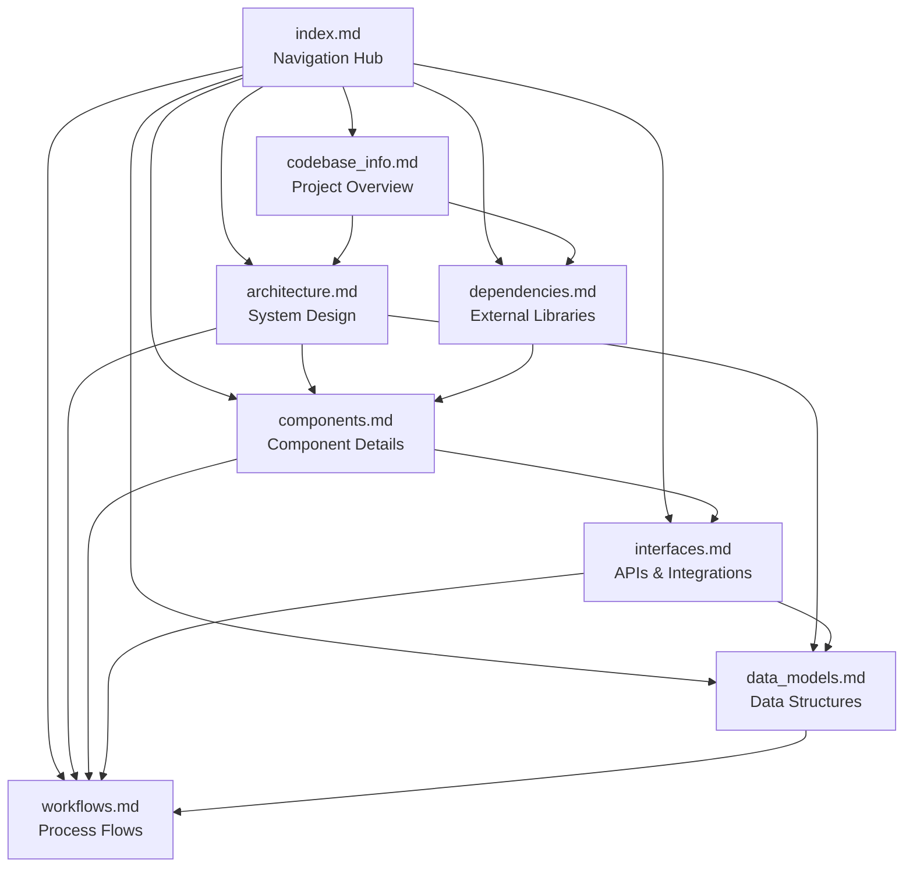

# Video Meet Documentation Index

## For AI Assistants: How to Use This Documentation

This documentation is designed to help AI assistants quickly understand and work with the Video Meet codebase. The index provides metadata about each documentation file to help you determine which files contain the information you need.

### Quick Start for AI Assistants

1. **Start here** - This index contains summaries of all documentation
2. **Identify relevant files** - Use the metadata tags and summaries below
3. **Dive deeper** - Read specific documentation files as needed
4. **Cross-reference** - Use the relationships section to find related information

### Documentation Structure

All documentation files are located in `.agents/summary/` directory:

```
.agents/summary/
├── index.md              # This file - navigation and metadata
├── codebase_info.md      # Project overview and structure
├── architecture.md       # System design and patterns
├── coding_patterns.md    # Detailed coding patterns and conventions
├── components.md         # Component descriptions
├── interfaces.md         # APIs and integrations
├── data_models.md        # Database schemas and models
├── workflows.md          # Process flows and sequences
└── dependencies.md       # External libraries
```

---

## Documentation Files

### 1. codebase_info.md

**Purpose:** High-level project overview and codebase structure

**When to Use:**
- Getting started with the codebase
- Understanding project scope and size
- Identifying technology stack
- Learning file organization
- Understanding design principles

**Key Topics:**
- Project statistics (252K LOC, 6,240 files)
- Technology stack (NestJS, React, LiveKit/OpenVidu)
- Directory structure
- Programming languages
- Architecture patterns
- Major features

**Metadata Tags:** `#overview` `#structure` `#tech-stack` `#getting-started`

**Related Files:** architecture.md, components.md

---

### 2. architecture.md

**Purpose:** System design, architectural patterns, and deployment strategies

**When to Use:**
- Understanding system architecture
- Learning about design patterns
- Planning new features
- Understanding data flow
- Deployment questions
- Scalability considerations

**Key Topics:**
- High-level architecture diagrams
- Backend modular design
- Frontend component hierarchy
- Data flow patterns (meeting creation, recording, webhooks)
- Storage architecture (multi-cloud)
- Distributed systems patterns (locking, pub/sub)
- Scheduled tasks
- Security architecture
- Deployment options (AWS, Docker)
- Design patterns (Repository, Service Layer, Provider, Observer, Strategy)

**Metadata Tags:** `#architecture` `#design-patterns` `#deployment` `#scalability` `#security`

**Related Files:** coding_patterns.md, components.md, workflows.md, data_models.md

---

### 3. coding_patterns.md

**Purpose:** Detailed coding patterns, conventions, and implementation examples

**When to Use:**
- Implementing new features or modules
- Understanding service/repository patterns
- Learning validation and error handling approaches
- Working with distributed systems (locking, scheduling)
- Integrating external services (LiveKit, storage providers)
- Following project-specific conventions
- Step-by-step development workflows

**Key Topics:**
- Module organization structure
- Service layer pattern with examples
- Repository pattern with cursor pagination
- DTO validation patterns
- Exception handling conventions
- Distributed locking for critical sections
- Scheduled tasks implementation
- Multi-cloud storage abstraction
- Development workflows (adding features, LiveKit integration, database operations)
- Common implementation tasks
- Testing patterns (future)

**Metadata Tags:** `#coding-patterns` `#conventions` `#examples` `#workflows` `#best-practices`

**Related Files:** architecture.md, components.md, workflows.md

---

### 4. components.md

**Purpose:** Detailed descriptions of all major components and their responsibilities

**When to Use:**
- Understanding specific components
- Finding component responsibilities
- Learning component interactions
- Identifying dependencies between components
- Modifying existing components
- Adding new components

**Key Topics:**
- **Backend Services:** RecordingService (759 LOC), RoomService (620 LOC), LiveKitService (411 LOC), RoomMemberService (388 LOC), RedisService (386 LOC), and 15+ more
- **Storage Components:** BlobStorageService, S3Service, GCSService, ABSService, MongoDBService
- **Repositories:** RoomRepository, RecordingRepository, BaseRepository
- **Helpers:** RecordingHelper, MutexService, TaskSchedulerService
- **Frontend Components:** UserManagement, MediaControls, App
- **Infrastructure:** InfraStack (AWS CDK)

**Metadata Tags:** `#components` `#services` `#repositories` `#helpers` `#frontend`

**Related Files:** architecture.md, interfaces.md

---

### 4. interfaces.md

**Purpose:** API endpoints, service interfaces, and external integrations

**When to Use:**
- Implementing API clients
- Understanding API contracts
- Integrating with external services
- Working with webhooks
- Understanding data schemas
- Testing APIs

**Key Topics:**
- **REST API Endpoints:**
  - Authentication (/auth/signin, /auth/refresh)
  - Meetings (/meetings - CRUD operations)
  - Recordings (/recordings - start, stop, download)
  - Webhooks (/openvidu/webhook)
- **Internal Interfaces:** IStorageProvider, IRepository, IMutexService
- **External SDK Integrations:**
  - LiveKit Server SDK (rooms, tokens, egress)
  - MongoDB (collections, operations)
  - Redis (caching, pub/sub, locking)
  - AWS S3, Azure Blob, Google Cloud Storage
- **Webhook Interfaces:** Incoming (LiveKit) and Outgoing (to external services)
- **Data Models:** Zod schemas for Room and Recording
- **Frontend API Client**
- **Error Responses and Rate Limiting**

**Metadata Tags:** `#api` `#endpoints` `#integrations` `#webhooks` `#sdk` `#interfaces`

**Related Files:** data_models.md, workflows.md, components.md

---

### 5. data_models.md

**Purpose:** Database schemas, domain models, and data structures

**When to Use:**
- Understanding data structure
- Working with database
- Creating new entities
- Modifying schemas
- Understanding relationships
- Data validation
- Migration planning

**Key Topics:**
- **Database Collections:**
  - Rooms (meeting room data)
  - Recordings (recording metadata)
  - Users (account information)
  - Migrations (schema versions)
  - GlobalConfig (app configuration)
- **Redis Data Structures:**
  - Distributed locks
  - Participant name reservations
  - Room cache
  - Session data
  - Pub/sub channels
- **Domain Models:** Room, Recording, Participant, User classes
- **DTOs:** CreateMeetingDto, StartRecordingDto, GenerateTokenDto
- **Response Models:** PaginatedResponse, ApiResponse
- **Validation Rules**
- **Data Relationships** (ER diagram)
- **Data Lifecycle** (room, recording, participant)
- **Data Retention** policies

**Metadata Tags:** `#data-models` `#database` `#schemas` `#entities` `#validation` `#redis`

**Related Files:** interfaces.md, workflows.md

---

### 6. workflows.md

**Purpose:** Step-by-step process flows and sequence diagrams

**When to Use:**
- Understanding user journeys
- Learning system processes
- Debugging issues
- Planning new features
- Understanding event sequences
- Error handling flows

**Key Topics:**
- **User Workflows:**
  1. User authentication
  2. Create meeting
  3. Join meeting
  4. Start recording
  5. Stop recording
  6. Download recording
- **System Workflows:**
  7. Webhook processing
  8. Scheduled cleanup
  9. Participant name reservation
  10. Distributed lock acquisition
  11. Room expiration
  12. Recording timeout handling
  13. Multi-cloud storage upload
  14. Real-time event broadcasting
  15. Token refresh
- **Error Handling:** Recording failure recovery
- **Performance:** Cursor-based pagination
- **Deployment:** AWS CDK deployment

**Metadata Tags:** `#workflows` `#processes` `#sequences` `#user-flows` `#system-flows`

**Related Files:** architecture.md, components.md, interfaces.md

---

### 7. dependencies.md

**Purpose:** External libraries, their purposes, and usage patterns

**When to Use:**
- Understanding dependencies
- Upgrading packages
- Troubleshooting dependency issues
- Evaluating alternatives
- Security audits
- Bundle size optimization

**Key Topics:**
- **Backend Dependencies:**
  - Core Framework (@nestjs/core, @nestjs/common)
  - Video Infrastructure (livekit-server-sdk)
  - Database (mongodb, mongoose)
  - Caching (ioredis, redlock)
  - Cloud Storage (@aws-sdk/client-s3, @azure/storage-blob, @google-cloud/storage)
  - Authentication (passport, passport-jwt, bcrypt)
  - Validation (class-validator, class-transformer)
  - Utilities (rxjs, node-cron, axios, uuid)
- **Frontend Dependencies:**
  - Core (react, react-dom)
  - Video Client (livekit-client)
  - Build Tools (vite)
  - Styling (tailwindcss)
  - HTTP Client (axios)
- **Infrastructure:** AWS CDK (aws-cdk-lib, constructs)
- **Dependency Graphs**
- **Version Compatibility**
- **Security Considerations**
- **Performance Impact**
- **Update Strategy**
- **Alternative Dependencies**
- **Licenses**

**Metadata Tags:** `#dependencies` `#libraries` `#packages` `#npm` `#security` `#performance`

**Related Files:** codebase_info.md, components.md

---

## Quick Reference Guide

### Common Questions and Where to Find Answers

| Question | Primary File | Secondary Files |
|----------|-------------|-----------------|
| How do I create a meeting? | workflows.md | interfaces.md, components.md |
| What APIs are available? | interfaces.md | workflows.md |
| How does recording work? | workflows.md | components.md, architecture.md |
| What's the database schema? | data_models.md | interfaces.md |
| How is the system architected? | architecture.md | components.md |
| What are the major components? | components.md | architecture.md |
| How do webhooks work? | workflows.md | interfaces.md |
| What dependencies are used? | dependencies.md | codebase_info.md |
| How to deploy the application? | architecture.md | workflows.md |
| What design patterns are used? | architecture.md | components.md |
| How does authentication work? | workflows.md | interfaces.md, architecture.md |
| What is the tech stack? | codebase_info.md | dependencies.md |
| How to add a new feature? | architecture.md | components.md, workflows.md |
| How does distributed locking work? | workflows.md | architecture.md, components.md |
| What storage providers are supported? | components.md | architecture.md, dependencies.md |

---

## Metadata Tags Reference

Use these tags to quickly find relevant documentation:

- `#overview` - High-level project information
- `#architecture` - System design and structure
- `#components` - Component descriptions
- `#api` - API endpoints and contracts
- `#data-models` - Database and data structures
- `#workflows` - Process flows
- `#dependencies` - External libraries
- `#tech-stack` - Technology choices
- `#design-patterns` - Software patterns
- `#deployment` - Deployment strategies
- `#security` - Security considerations
- `#performance` - Performance optimization
- `#integrations` - External service integrations
- `#webhooks` - Webhook handling
- `#frontend` - Frontend-specific
- `#backend` - Backend-specific
- `#database` - Database-related
- `#redis` - Redis-related
- `#storage` - Cloud storage
- `#video` - Video infrastructure

---

## Documentation Relationships



---

## How to Navigate This Documentation

### For New Developers
1. Start with `codebase_info.md` - Get the big picture
2. Read `architecture.md` - Understand the system design
3. Review `workflows.md` - Learn key processes
4. Explore `components.md` - Dive into specific components

### For API Integration
1. Start with `interfaces.md` - API endpoints and contracts
2. Review `workflows.md` - Understand API flows
3. Check `data_models.md` - Request/response formats

### For Feature Development
1. Review `architecture.md` - Understand design patterns
2. Check `components.md` - Find relevant components
3. Study `workflows.md` - Understand existing flows
4. Reference `interfaces.md` - API contracts
5. Check `data_models.md` - Data structures

### For Debugging
1. Check `workflows.md` - Understand the expected flow
2. Review `components.md` - Component responsibilities
3. Check `interfaces.md` - API contracts
4. Review `data_models.md` - Data validation rules

### For Deployment
1. Read `architecture.md` - Deployment strategies
2. Check `dependencies.md` - Required packages
3. Review `workflows.md` - Deployment process

---

## Documentation Maintenance

### Last Updated
- **Date:** 2026-02-25
- **Codebase Size:** 252,285 LOC across 6,240 files
- **Documentation Version:** 1.0

### Update Frequency
- **Major Updates:** When significant features are added
- **Minor Updates:** When components are modified
- **Patch Updates:** For corrections and clarifications

### How to Update
1. Modify relevant documentation files
2. Update this index if new files are added
3. Update metadata tags if topics change
4. Update relationships diagram if structure changes

---

## Tips for AI Assistants

### Efficient Information Retrieval
1. **Use this index first** - Don't read all files unnecessarily
2. **Follow the relationships** - Related information is linked
3. **Use metadata tags** - Quickly filter relevant content
4. **Check the quick reference** - Common questions are mapped

### When Answering Questions
1. **Cite sources** - Reference specific documentation files
2. **Provide context** - Link to related documentation
3. **Be specific** - Point to exact sections when possible
4. **Cross-reference** - Mention related topics

### When Suggesting Changes
1. **Check architecture** - Ensure alignment with design patterns
2. **Review workflows** - Understand impact on existing processes
3. **Verify interfaces** - Maintain API contracts
4. **Consider data models** - Ensure schema compatibility

---

## Additional Resources

### External Documentation
- **NestJS:** https://docs.nestjs.com/
- **LiveKit:** https://docs.livekit.io/
- **React:** https://react.dev/
- **MongoDB:** https://www.mongodb.com/docs/
- **Redis:** https://redis.io/docs/

### Code Examples
- HTTP test files in `video-meet-api/http/`
- Example applications in `video-meet-api/example/` and `video-meet-api/example-openvidu/`

### Configuration Files
- Backend: `video-meet-api/.env.example`
- Frontend: `video-meet-ui/.env.example`
- Infrastructure: `video-meet-api/infra/config.dev.ts`

---

## Summary

This documentation provides comprehensive coverage of the Video Meet application:

- **7 documentation files** covering all aspects of the system
- **Detailed component descriptions** for 30+ major components
- **Complete API documentation** with request/response examples
- **18 workflow diagrams** showing key processes
- **Comprehensive dependency catalog** with usage patterns
- **Database schemas** for all collections
- **Architecture diagrams** showing system design

Use this index as your starting point to navigate the documentation efficiently and find the information you need quickly.
