# Workflows

## Overview

This document describes the key workflows and processes in the Video Meet application.

## User Workflows

### 1. User Authentication Flow

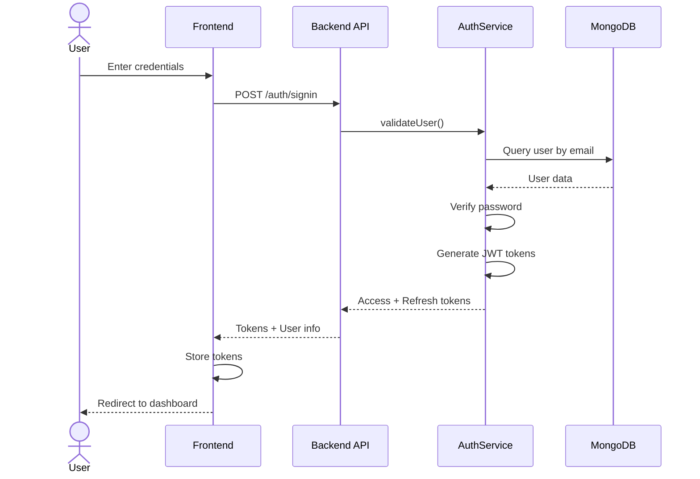
```mermaid
sequenceDiagram
    actor User
    participant UI as Frontend
    participant API as Backend API
    participant Auth as AuthService
    participant DB as MongoDB
    
    User->>UI: Enter credentials
    UI->>API: POST /auth/signin
    API->>Auth: validateUser()
    Auth->>DB: Query user by email
    DB-->>Auth: User data
    Auth->>Auth: Verify password
    Auth->>Auth: Generate JWT tokens
    Auth-->>API: Access + Refresh tokens
    API-->>UI: Tokens + User info
    UI->>UI: Store tokens
    UI-->>User: Redirect to dashboard
```

**Steps:**
1. User enters email and password
2. Frontend sends credentials to backend
3. Backend validates credentials against database
4. Backend generates JWT access and refresh tokens
5. Frontend stores tokens securely
6. User is redirected to application

---

### 2. Create Meeting Flow

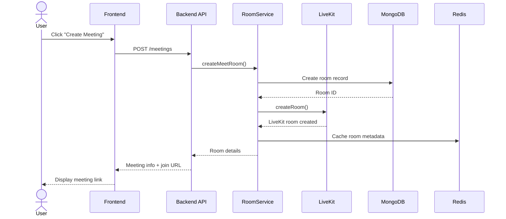
```mermaid
sequenceDiagram
    actor User
    participant UI as Frontend
    participant API as Backend API
    participant Room as RoomService
    participant LK as LiveKit
    participant DB as MongoDB
    participant Redis
    
    User->>UI: Click "Create Meeting"
    UI->>API: POST /meetings
    API->>Room: createMeetRoom()
    Room->>DB: Create room record
    DB-->>Room: Room ID
    Room->>LK: createRoom()
    LK-->>Room: LiveKit room created
    Room->>Redis: Cache room metadata
    Room-->>API: Room details
    API-->>UI: Meeting info + join URL
    UI-->>User: Display meeting link
```

**Steps:**
1. User initiates meeting creation
2. Backend creates database record
3. Backend creates LiveKit room
4. Backend caches room metadata in Redis
5. Frontend receives meeting details
6. User can share meeting link

---

### 3. Join Meeting Flow

```mermaid
sequenceDiagram
    actor Participant
    participant UI as Frontend
    participant API as Backend API
    participant Member as RoomMemberService
    participant Name as ParticipantNameService
    participant LK as LiveKit
    participant Redis
    
    Participant->>UI: Enter meeting + name
    UI->>API: POST /meetings/:id/tokens
    API->>Member: generateOrRefreshRoomMemberToken()
    Member->>Name: reserveUniqueName()
    Name->>Redis: Check name availability
    alt Name available
        Redis-->>Name: Name reserved
    else Name taken
        Name->>Name: Generate alternative (e.g., "John 2")
        Name->>Redis: Reserve alternative
    end
    Name-->>Member: Unique name
    Member->>Member: Generate LiveKit token
    Member-->>API: Token + participant ID
    API-->>UI: Join token
    UI->>LK: Connect with token
    LK-->>UI: Connected to room
    UI-->>Participant: In meeting
```

**Steps:**
1. Participant enters meeting ID and name
2. Backend reserves unique participant name
3. Backend generates LiveKit access token
4. Frontend connects to LiveKit room
5. Participant joins video call

---

### 4. Start Recording Flow

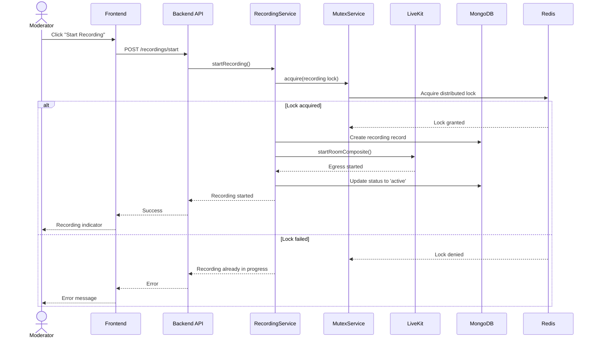
```mermaid
sequenceDiagram
    actor Moderator
    participant UI as Frontend
    participant API as Backend API
    participant Rec as RecordingService
    participant Mutex as MutexService
    participant LK as LiveKit
    participant DB as MongoDB
    participant Redis
    
    Moderator->>UI: Click "Start Recording"
    UI->>API: POST /recordings/start
    API->>Rec: startRecording()
    Rec->>Mutex: acquire(recording lock)
    Mutex->>Redis: Acquire distributed lock
    alt Lock acquired
        Redis-->>Mutex: Lock granted
        Rec->>DB: Create recording record
        Rec->>LK: startRoomComposite()
        LK-->>Rec: Egress started
        Rec->>DB: Update status to 'active'
        Rec-->>API: Recording started
        API-->>UI: Success
        UI-->>Moderator: Recording indicator
    else Lock failed
        Redis-->>Mutex: Lock denied
        Rec-->>API: Recording already in progress
        API-->>UI: Error
        UI-->>Moderator: Error message
    end
```

**Steps:**
1. Moderator initiates recording
2. Backend acquires distributed lock
3. Backend creates recording record
4. Backend starts LiveKit egress
5. Frontend shows recording indicator
6. Recording proceeds in background

---

### 5. Stop Recording Flow

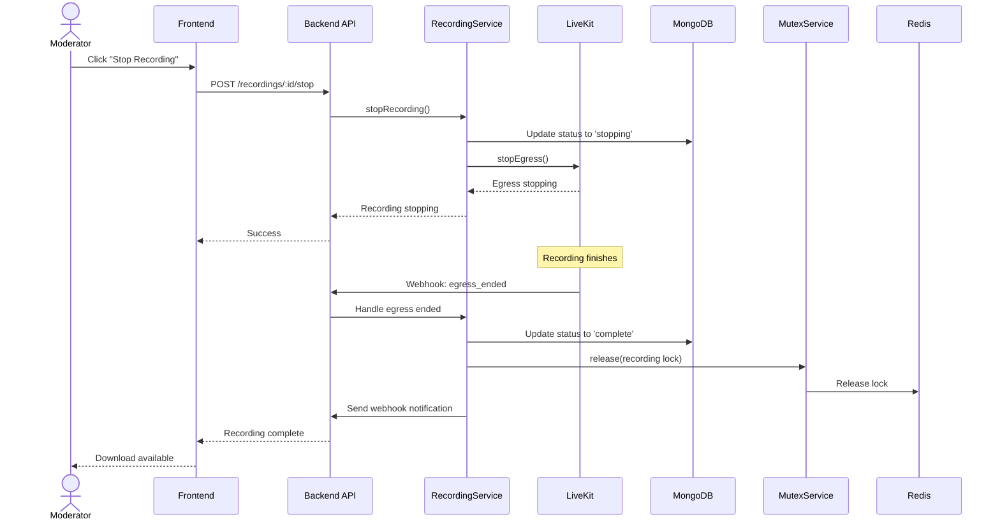
```mermaid
sequenceDiagram
    actor Moderator
    participant UI as Frontend
    participant API as Backend API
    participant Rec as RecordingService
    participant LK as LiveKit
    participant DB as MongoDB
    participant Mutex as MutexService
    participant Redis
    
    Moderator->>UI: Click "Stop Recording"
    UI->>API: POST /recordings/:id/stop
    API->>Rec: stopRecording()
    Rec->>DB: Update status to 'stopping'
    Rec->>LK: stopEgress()
    LK-->>Rec: Egress stopping
    Rec-->>API: Recording stopping
    API-->>UI: Success
    
    Note over LK: Recording finishes
    
    LK->>API: Webhook: egress_ended
    API->>Rec: Handle egress ended
    Rec->>DB: Update status to 'complete'
    Rec->>Mutex: release(recording lock)
    Mutex->>Redis: Release lock
    Rec->>API: Send webhook notification
    API-->>UI: Recording complete
    UI-->>Moderator: Download available
```

**Steps:**
1. Moderator stops recording
2. Backend updates status to 'stopping'
3. Backend requests LiveKit to stop egress
4. LiveKit finishes recording and sends webhook
5. Backend updates status to 'complete'
6. Backend releases distributed lock
7. Frontend notifies recording is ready

---

### 6. Download Recording Flow

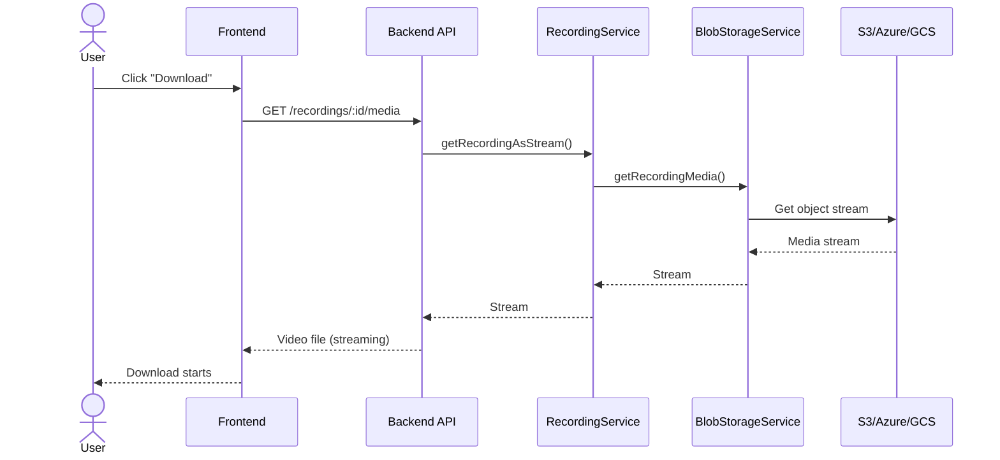
```mermaid
sequenceDiagram
    actor User
    participant UI as Frontend
    participant API as Backend API
    participant Rec as RecordingService
    participant Storage as BlobStorageService
    participant Cloud as S3/Azure/GCS
    
    User->>UI: Click "Download"
    UI->>API: GET /recordings/:id/media
    API->>Rec: getRecordingAsStream()
    Rec->>Storage: getRecordingMedia()
    Storage->>Cloud: Get object stream
    Cloud-->>Storage: Media stream
    Storage-->>Rec: Stream
    Rec-->>API: Stream
    API-->>UI: Video file (streaming)
    UI-->>User: Download starts
```

**Steps:**
1. User requests recording download
2. Backend retrieves recording from cloud storage
3. Backend streams recording to frontend
4. User downloads video file

---

## System Workflows

### 7. Webhook Processing Flow

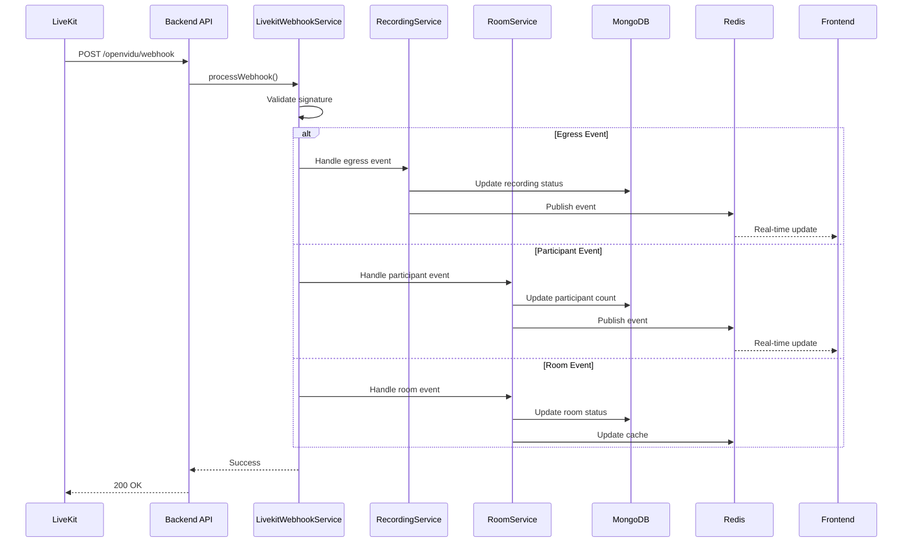
```mermaid
sequenceDiagram
    participant LK as LiveKit
    participant API as Backend API
    participant Webhook as LivekitWebhookService
    participant Rec as RecordingService
    participant Room as RoomService
    participant DB as MongoDB
    participant Redis
    participant Frontend
    
    LK->>API: POST /openvidu/webhook
    API->>Webhook: processWebhook()
    Webhook->>Webhook: Validate signature
    
    alt Egress Event
        Webhook->>Rec: Handle egress event
        Rec->>DB: Update recording status
        Rec->>Redis: Publish event
        Redis-->>Frontend: Real-time update
    else Participant Event
        Webhook->>Room: Handle participant event
        Room->>DB: Update participant count
        Room->>Redis: Publish event
        Redis-->>Frontend: Real-time update
    else Room Event
        Webhook->>Room: Handle room event
        Room->>DB: Update room status
        Room->>Redis: Update cache
    end
    
    Webhook-->>API: Success
    API-->>LK: 200 OK
```

**Steps:**
1. LiveKit sends webhook to backend
2. Backend validates webhook signature
3. Backend processes event based on type
4. Backend updates database
5. Backend publishes real-time updates
6. Frontend receives updates via Redis pub/sub

---

### 8. Scheduled Cleanup Flow

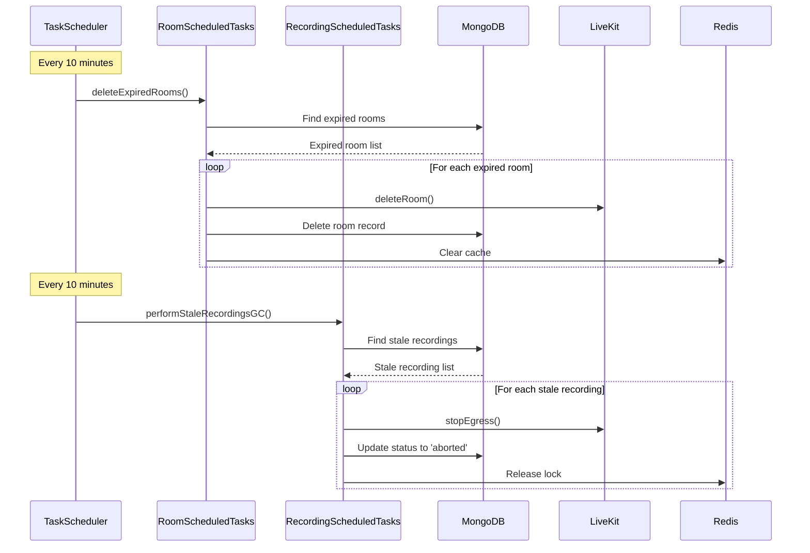
```mermaid
sequenceDiagram
    participant Scheduler as TaskScheduler
    participant RoomGC as RoomScheduledTasks
    participant RecGC as RecordingScheduledTasks
    participant DB as MongoDB
    participant LK as LiveKit
    participant Redis
    
    Note over Scheduler: Every 10 minutes
    
    Scheduler->>RoomGC: deleteExpiredRooms()
    RoomGC->>DB: Find expired rooms
    DB-->>RoomGC: Expired room list
    loop For each expired room
        RoomGC->>LK: deleteRoom()
        RoomGC->>DB: Delete room record
        RoomGC->>Redis: Clear cache
    end
    
    Note over Scheduler: Every 10 minutes
    
    Scheduler->>RecGC: performStaleRecordingsGC()
    RecGC->>DB: Find stale recordings
    DB-->>RecGC: Stale recording list
    loop For each stale recording
        RecGC->>LK: stopEgress()
        RecGC->>DB: Update status to 'aborted'
        RecGC->>Redis: Release lock
    end
```

**Steps:**
1. Scheduler triggers cleanup tasks
2. Room cleanup: Delete expired rooms
3. Recording cleanup: Abort stale recordings
4. Lock cleanup: Release orphaned locks
5. Name cleanup: Release expired name reservations

---

### 9. Participant Name Reservation Flow

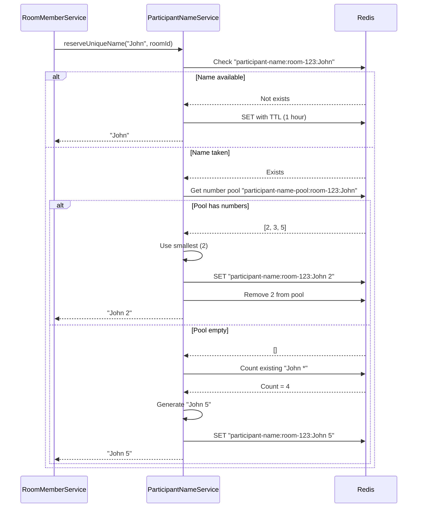
```mermaid
sequenceDiagram
    participant Service as RoomMemberService
    participant Name as ParticipantNameService
    participant Redis
    
    Service->>Name: reserveUniqueName("John", roomId)
    Name->>Redis: Check "participant-name:room-123:John"
    
    alt Name available
        Redis-->>Name: Not exists
        Name->>Redis: SET with TTL (1 hour)
        Name-->>Service: "John"
    else Name taken
        Redis-->>Name: Exists
        Name->>Redis: Get number pool "participant-name-pool:room-123:John"
        alt Pool has numbers
            Redis-->>Name: [2, 3, 5]
            Name->>Name: Use smallest (2)
            Name->>Redis: SET "participant-name:room-123:John 2"
            Name->>Redis: Remove 2 from pool
            Name-->>Service: "John 2"
        else Pool empty
            Redis-->>Name: []
            Name->>Redis: Count existing "John *"
            Redis-->>Name: Count = 4
            Name->>Name: Generate "John 5"
            Name->>Redis: SET "participant-name:room-123:John 5"
            Name-->>Service: "John 5"
        end
    end
```

**Steps:**
1. Service requests unique name
2. Check if base name is available
3. If taken, check number pool for available variants
4. Reserve name with TTL
5. Return unique name to service

---

### 10. Distributed Lock Acquisition Flow

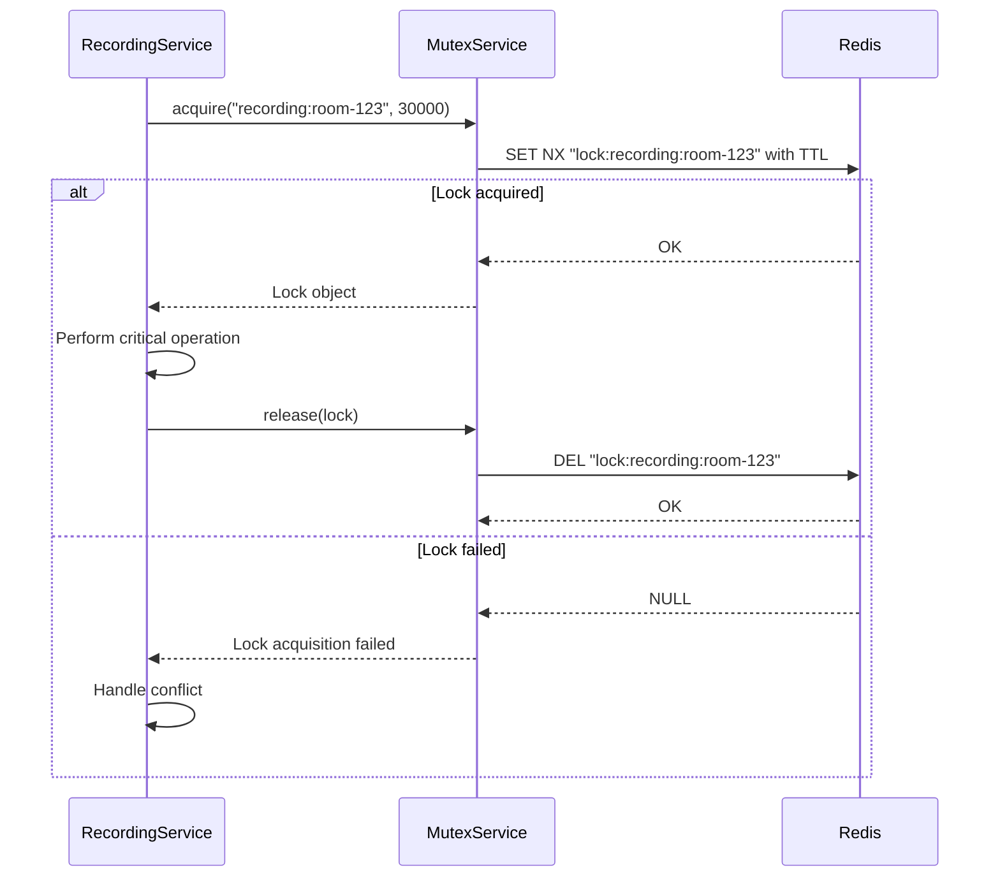
```mermaid
sequenceDiagram
    participant Service as RecordingService
    participant Mutex as MutexService
    participant Redis
    
    Service->>Mutex: acquire("recording:room-123", 30000)
    Mutex->>Redis: SET NX "lock:recording:room-123" with TTL
    
    alt Lock acquired
        Redis-->>Mutex: OK
        Mutex-->>Service: Lock object
        Service->>Service: Perform critical operation
        Service->>Mutex: release(lock)
        Mutex->>Redis: DEL "lock:recording:room-123"
        Redis-->>Mutex: OK
    else Lock failed
        Redis-->>Mutex: NULL
        Mutex-->>Service: Lock acquisition failed
        Service->>Service: Handle conflict
    end
```

**Steps:**
1. Service requests distributed lock
2. Mutex service attempts to acquire lock in Redis
3. If successful, service performs critical operation
4. Service releases lock when done
5. If failed, service handles conflict

---

### 11. Room Expiration Flow

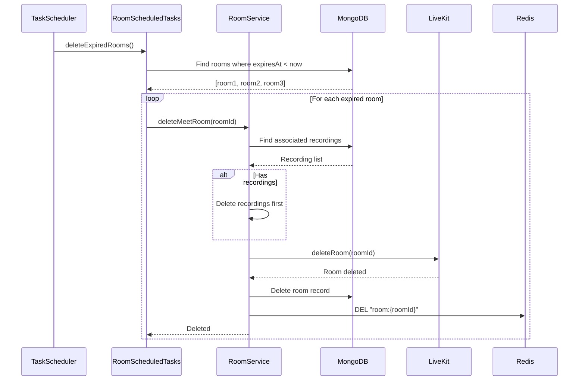
```mermaid
sequenceDiagram
    participant Scheduler as TaskScheduler
    participant RoomGC as RoomScheduledTasks
    participant Room as RoomService
    participant DB as MongoDB
    participant LK as LiveKit
    participant Redis
    
    Scheduler->>RoomGC: deleteExpiredRooms()
    RoomGC->>DB: Find rooms where expiresAt < now
    DB-->>RoomGC: [room1, room2, room3]
    
    loop For each expired room
        RoomGC->>Room: deleteMeetRoom(roomId)
        Room->>DB: Find associated recordings
        DB-->>Room: Recording list
        
        alt Has recordings
            Room->>Room: Delete recordings first
        end
        
        Room->>LK: deleteRoom(roomId)
        LK-->>Room: Room deleted
        Room->>DB: Delete room record
        Room->>Redis: DEL "room:{roomId}"
        Room-->>RoomGC: Deleted
    end
```

**Steps:**
1. Scheduler triggers expiration check
2. Query database for expired rooms
3. For each expired room:
   - Delete associated recordings
   - Delete LiveKit room
   - Delete database record
   - Clear Redis cache

---

### 12. Recording Timeout Handling Flow

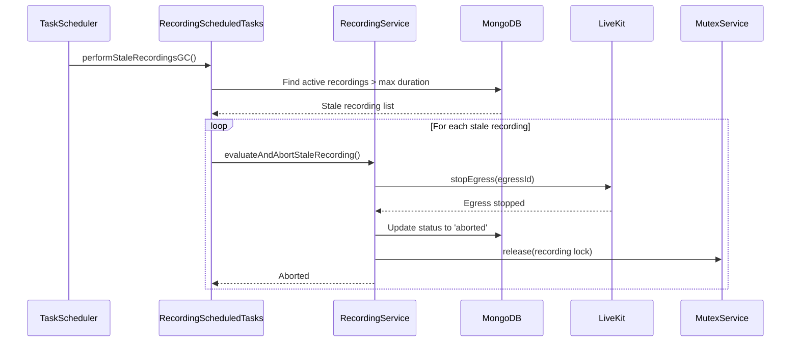
```mermaid
sequenceDiagram
    participant Scheduler as TaskScheduler
    participant RecGC as RecordingScheduledTasks
    participant Rec as RecordingService
    participant DB as MongoDB
    participant LK as LiveKit
    participant Mutex as MutexService
    
    Scheduler->>RecGC: performStaleRecordingsGC()
    RecGC->>DB: Find active recordings > max duration
    DB-->>RecGC: Stale recording list
    
    loop For each stale recording
        RecGC->>Rec: evaluateAndAbortStaleRecording()
        Rec->>LK: stopEgress(egressId)
        LK-->>Rec: Egress stopped
        Rec->>DB: Update status to 'aborted'
        Rec->>Mutex: release(recording lock)
        Rec-->>RecGC: Aborted
    end
```

**Steps:**
1. Scheduler checks for stale recordings
2. Query recordings exceeding max duration
3. For each stale recording:
   - Stop LiveKit egress
   - Update status to 'aborted'
   - Release distributed lock

---

### 13. Multi-Cloud Storage Upload Flow

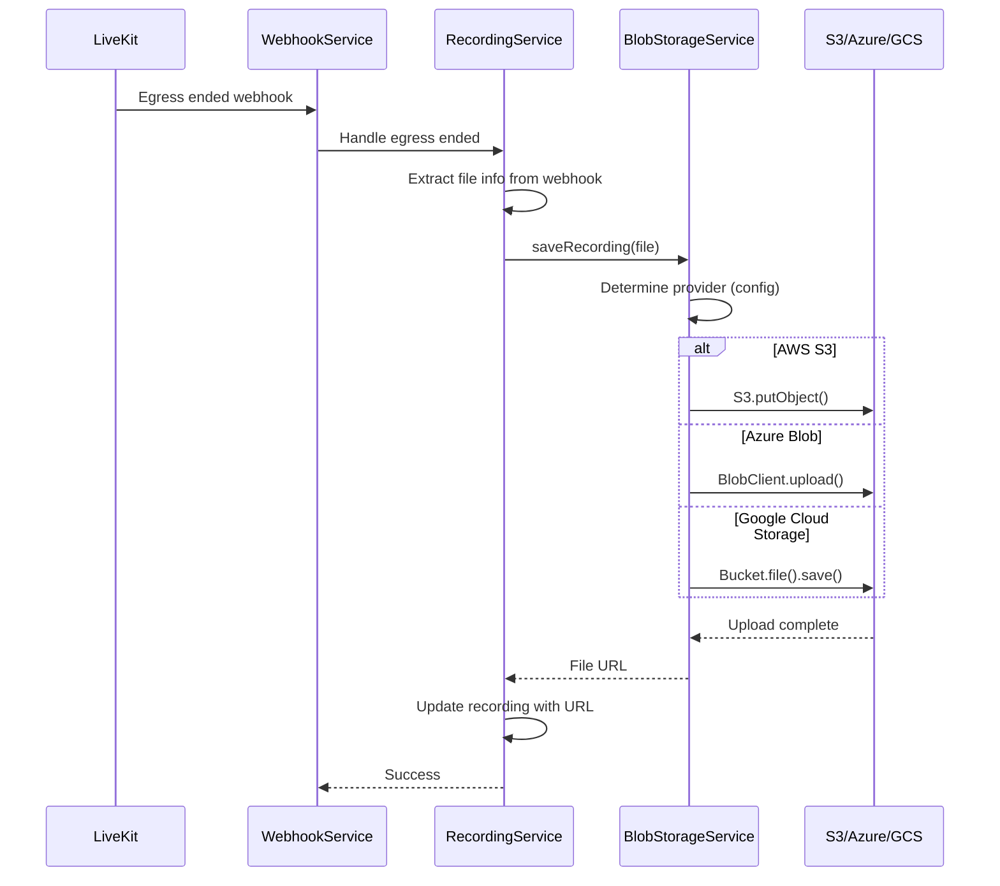
```mermaid
sequenceDiagram
    participant LK as LiveKit
    participant Webhook as WebhookService
    participant Rec as RecordingService
    participant Storage as BlobStorageService
    participant Provider as S3/Azure/GCS
    
    LK->>Webhook: Egress ended webhook
    Webhook->>Rec: Handle egress ended
    Rec->>Rec: Extract file info from webhook
    Rec->>Storage: saveRecording(file)
    Storage->>Storage: Determine provider (config)
    
    alt AWS S3
        Storage->>Provider: S3.putObject()
    else Azure Blob
        Storage->>Provider: BlobClient.upload()
    else Google Cloud Storage
        Storage->>Provider: Bucket.file().save()
    end
    
    Provider-->>Storage: Upload complete
    Storage-->>Rec: File URL
    Rec->>Rec: Update recording with URL
    Rec-->>Webhook: Success
```

**Steps:**
1. LiveKit completes recording
2. Webhook handler receives notification
3. Recording service extracts file information
4. Storage service uploads to configured provider
5. Recording updated with download URL

---

### 14. Real-Time Event Broadcasting Flow

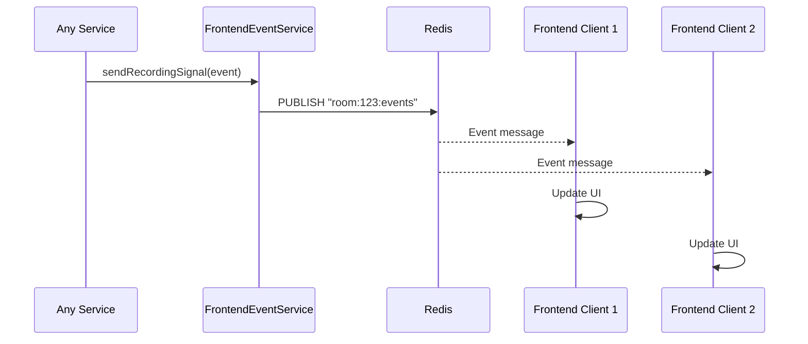
```mermaid
sequenceDiagram
    participant Service as Any Service
    participant Frontend as FrontendEventService
    participant Redis
    participant Client1 as Frontend Client 1
    participant Client2 as Frontend Client 2
    
    Service->>Frontend: sendRecordingSignal(event)
    Frontend->>Redis: PUBLISH "room:123:events"
    Redis-->>Client1: Event message
    Redis-->>Client2: Event message
    Client1->>Client1: Update UI
    Client2->>Client2: Update UI
```

**Steps:**
1. Backend service triggers event
2. Frontend event service publishes to Redis
3. All subscribed clients receive event
4. Clients update UI in real-time

---

### 15. Token Refresh Flow

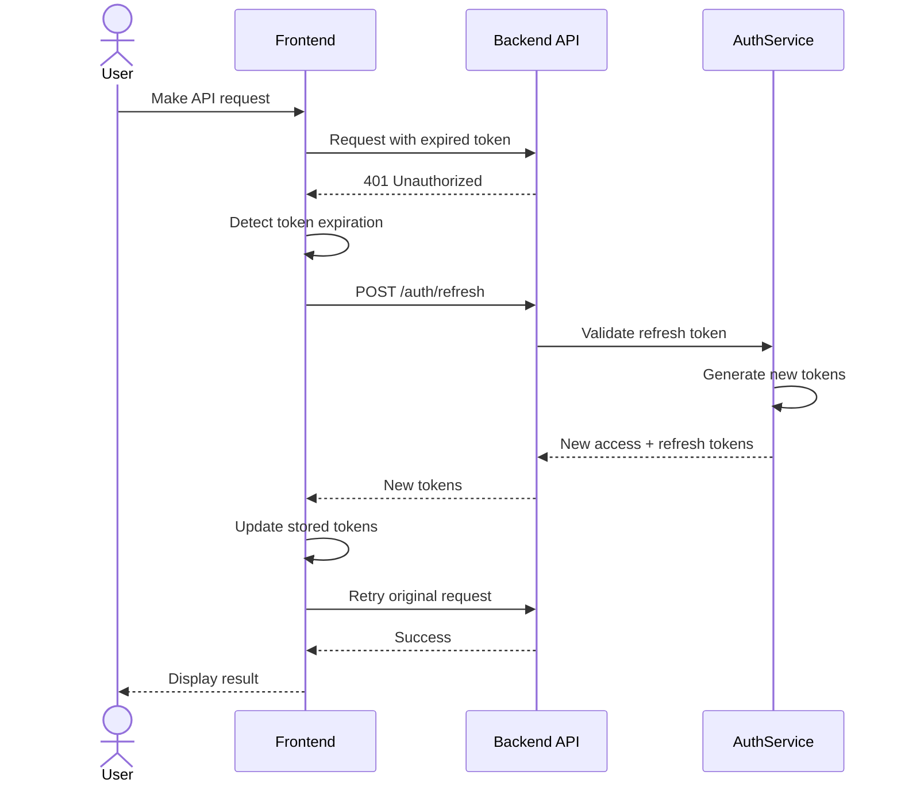
```mermaid
sequenceDiagram
    actor User
    participant UI as Frontend
    participant API as Backend API
    participant Auth as AuthService
    
    User->>UI: Make API request
    UI->>API: Request with expired token
    API-->>UI: 401 Unauthorized
    UI->>UI: Detect token expiration
    UI->>API: POST /auth/refresh
    API->>Auth: Validate refresh token
    Auth->>Auth: Generate new tokens
    Auth-->>API: New access + refresh tokens
    API-->>UI: New tokens
    UI->>UI: Update stored tokens
    UI->>API: Retry original request
    API-->>UI: Success
    UI-->>User: Display result
```

**Steps:**
1. User makes request with expired token
2. Backend returns 401 Unauthorized
3. Frontend detects expiration
4. Frontend requests token refresh
5. Backend validates refresh token
6. Backend generates new tokens
7. Frontend retries original request

---

## Error Handling Workflows

### 16. Recording Failure Recovery

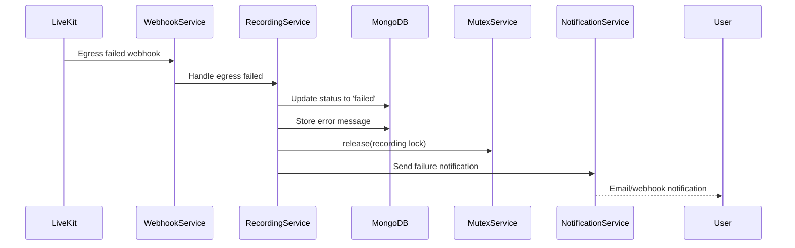
```mermaid
sequenceDiagram
    participant LK as LiveKit
    participant Webhook as WebhookService
    participant Rec as RecordingService
    participant DB as MongoDB
    participant Mutex as MutexService
    participant Notify as NotificationService
    
    LK->>Webhook: Egress failed webhook
    Webhook->>Rec: Handle egress failed
    Rec->>DB: Update status to 'failed'
    Rec->>DB: Store error message
    Rec->>Mutex: release(recording lock)
    Rec->>Notify: Send failure notification
    Notify-->>User: Email/webhook notification
```

**Steps:**
1. LiveKit reports egress failure
2. Backend updates recording status
3. Backend stores error details
4. Backend releases lock
5. Backend sends failure notification

---

## Performance Optimization Workflows

### 17. Cursor-Based Pagination

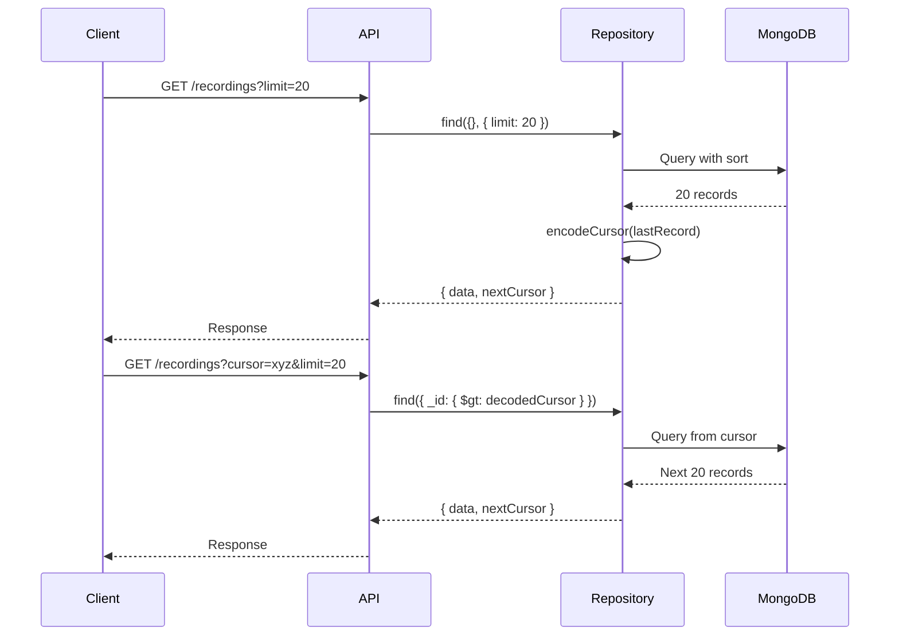
```mermaid
sequenceDiagram
    participant Client
    participant API
    participant Repo as Repository
    participant DB as MongoDB
    
    Client->>API: GET /recordings?limit=20
    API->>Repo: find({}, { limit: 20 })
    Repo->>DB: Query with sort
    DB-->>Repo: 20 records
    Repo->>Repo: encodeCursor(lastRecord)
    Repo-->>API: { data, nextCursor }
    API-->>Client: Response
    
    Client->>API: GET /recordings?cursor=xyz&limit=20
    API->>Repo: find({ _id: { $gt: decodedCursor } })
    Repo->>DB: Query from cursor
    DB-->>Repo: Next 20 records
    Repo-->>API: { data, nextCursor }
    API-->>Client: Response
```

**Steps:**
1. Client requests first page
2. Backend queries database
3. Backend encodes cursor from last record
4. Client requests next page with cursor
5. Backend decodes cursor and queries from that point
6. Process repeats for subsequent pages

---

## Deployment Workflows

### 18. AWS CDK Deployment

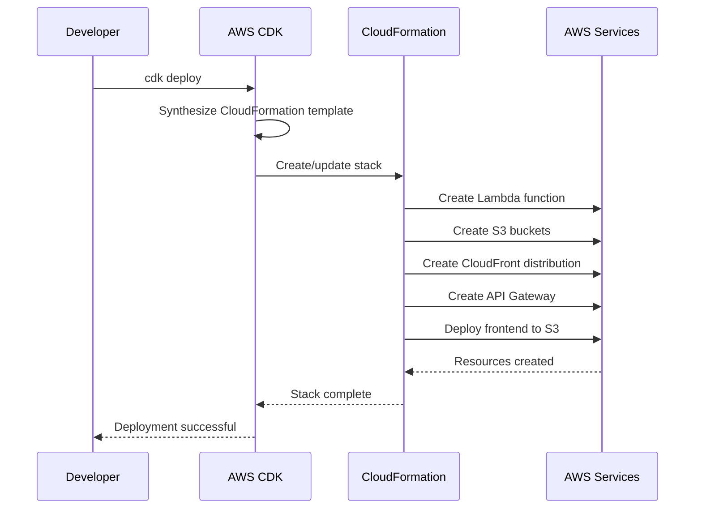
```mermaid
sequenceDiagram
    participant Dev as Developer
    participant CDK as AWS CDK
    participant CF as CloudFormation
    participant AWS as AWS Services
    
    Dev->>CDK: cdk deploy
    CDK->>CDK: Synthesize CloudFormation template
    CDK->>CF: Create/update stack
    CF->>AWS: Create Lambda function
    CF->>AWS: Create S3 buckets
    CF->>AWS: Create CloudFront distribution
    CF->>AWS: Create API Gateway
    CF->>AWS: Deploy frontend to S3
    AWS-->>CF: Resources created
    CF-->>CDK: Stack complete
    CDK-->>Dev: Deployment successful
```

**Steps:**
1. Developer runs CDK deploy command
2. CDK synthesizes CloudFormation template
3. CloudFormation creates/updates AWS resources
4. Application is deployed and accessible

---

This comprehensive workflow documentation covers the major processes in the Video Meet application, from user interactions to system maintenance and deployment.
